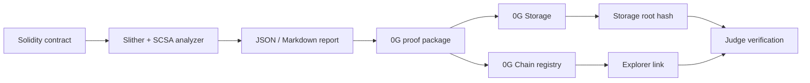

# SCSA 0G Audit Proof

SCSA 0G Audit Proof is an AI-assisted Solidity security triage assistant that produces traceable audit reports and registers proof of each report on 0G.

## 0G Modules Used

- 0G Storage stores the audit proof JSON artifact.
- 0G Chain stores an immutable registry event containing report hash, storage root, security score, and timestamp.

## Architecture



## Local Reproduction

```bash
uv sync --extra audit --dev
uv run scsa analyze tests/contracts/VulnerableVault.sol --out-dir reports --native-build-policy disabled
uv run scsa 0g-package reports/vulnerablevault.json --out-dir reports-0g --project-name "SCSA 0G Audit Proof" --track "Track 1: Agentic Infrastructure & OpenClaw Lab"
```

## 0G Live Proof

Registry contract address:

Registry explorer link:

Storage root hash:

Storage upload transaction:

Proof registration transaction:
