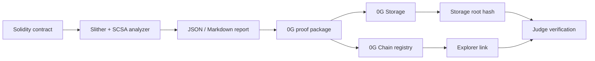

# SCSA 0G Audit Proof

SCSA 0G Audit Proof is an AI-assisted Solidity security triage assistant that produces traceable audit reports and prepares each report for pending live proof registration on 0G.

## 0G Modules Used

- 0G Storage will store the audit proof JSON artifact after live deployment.
- 0G Chain will store an immutable registry event containing report hash, storage root, security score, and timestamp after live deployment.

## Architecture



## Local Reproduction

```bash
uv sync --extra audit --dev
uv run scsa analyze tests/contracts/VulnerableVault.sol --out-dir reports --native-build-policy disabled
uv run scsa 0g-package reports/vulnerablevault.json --out-dir reports-0g --project-name "SCSA 0G Audit Proof" --track "Track 1: Agentic Infrastructure & OpenClaw Lab"
cd integrations/0g
npm install
npm run upload -- ../../reports-0g/vulnerablevault/audit-proof.json
npm run register -- ../../reports-0g/vulnerablevault/submission-proof.json
cd ../..
uv run scsa 0g-attach-proof reports/vulnerablevault.json reports-0g/vulnerablevault/submission-proof.json
```

## Live 0G Environment

Required variables use empty values here so no endpoint override, private key, or deployed address is committed:

```bash
export ZERO_G_RPC_URL=""
export ZERO_G_PRIVATE_KEY=""
export ZERO_G_STORAGE_INDEXER_RPC=""
export ZERO_G_REGISTRY_ADDRESS=""
export ZERO_G_EXPLORER_TX_BASE=""
export ZERO_G_EXPLORER_ADDRESS_BASE=""
```

Never commit `.env` or private keys. The repository includes only `.env.example`.

## 0G Live Proof

Live proof fields are pending until deployment and registration complete.

Registry contract address:

Registry explorer link:

Storage root hash:

Storage upload transaction:

Storage explorer link:

Proof registration transaction:

Proof registration explorer link:

Expected `submission-proof.json` link keys: `storage_tx`, `registry`, `registration_tx`.
