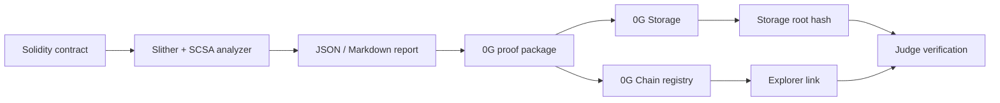

# SCSA 0G Audit Proof

SCSA 0G Audit Proof is an AI-assisted Solidity security triage assistant that packages each report for live 0G Storage persistence and 0G Chain proof registration.

Submission readiness: blocked until `proof_mode=live_registered`, public Explorer links, and public X post URL are filled. Public frontend demo: https://eskasia.github.io/smart-contract-security-assistant/. Public demo video: https://eskasia.github.io/smart-contract-security-assistant/scsa-usage-tutorial.mp4?v=7aa1ab4.

## Submission Package Files

| Requirement | File |
|---|---|
| HackQuest form fields | `docs/hackathon/0g-apac-submission.md`, `docs/hackathon/hackquest-submission.form.json` |
| 0G live proof record | `docs/hackathon/004-live-0g-proof-record.md` |
| Demo video script and checklist | `docs/hackathon/0g-demo-script.md`, `docs/hackathon/006-demo-video-production-checklist.md` |
| Public X post | `docs/hackathon/005-public-x-post-template.md` |
| Judge reproduction | `docs/hackathon/007-judge-reproduction-guide.md` |
| Submission checklist | `docs/hackathon/003-submission-package-index.md` |

## 0G Modules Used

- 0G Storage: live upload stores the audit proof JSON artifact and returns `storage_root_hash` plus `storage_tx_hash`.
- 0G Chain: live registry stores report hash, storage root, security score, timestamp, and contract id through `AuditProofRegistry`.
- Final submission proof: `submission-proof.json.proof_mode` must be `live_registered`.

## Architecture



## Final Live Proof Flow

Run this flow after the deployer wallet is funded on 0G Mainnet.

```bash
uv sync --extra audit --dev
mkdir -p reports
uv run scsa analyze tests/contracts/VulnerableVault.sol --out-dir reports --native-build-policy disabled > reports/latest-analysis.json
REPORT_ID=$(uv run python -c 'import json; print(json.load(open("reports/latest-analysis.json"))["contract_id"])')
uv run scsa 0g-package reports/latest-analysis.json --out-dir reports-0g --project-name "SCSA 0G Audit Proof" --track "Track 1: Agentic Infrastructure & OpenClaw Lab"
cd integrations/0g
npm install
export ZERO_G_RPC_URL=https://evmrpc.0g.ai
export ZERO_G_PRIVATE_KEY=
export ZERO_G_STORAGE_INDEXER_RPC=https://indexer-storage-turbo.0g.ai
npm run deploy
export ZERO_G_REGISTRY_ADDRESS="<paste registry_address from deploy output>"
npm run upload -- "../../reports-0g/$REPORT_ID/audit-proof.json"
npm run register -- "../../reports-0g/$REPORT_ID/submission-proof.json"
npm run verify-proof -- "../../reports-0g/$REPORT_ID/submission-proof.json"
cd ../..
uv run scsa 0g-attach-proof reports/latest-analysis.json "reports-0g/$REPORT_ID/submission-proof.json"
```

Expected final proof: `proof_mode=live_registered`; `explorer_links.storage_tx`, `explorer_links.registry`, and `explorer_links.registration_tx` open publicly.

## Reviewer Local Reproduction

Dry-run is only for local reproducibility checks and is not valid HackQuest 0G proof.

```bash
uv sync --extra audit --dev
mkdir -p reports
uv run scsa analyze tests/contracts/VulnerableVault.sol --out-dir reports --native-build-policy disabled > reports/latest-analysis.json
REPORT_ID=$(uv run python -c 'import json; print(json.load(open("reports/latest-analysis.json"))["contract_id"])')
uv run scsa 0g-package reports/latest-analysis.json --out-dir reports-0g --project-name "SCSA 0G Audit Proof" --track "Track 1: Agentic Infrastructure & OpenClaw Lab"
cd integrations/0g
npm install
npm run upload -- "../../reports-0g/$REPORT_ID/audit-proof.json" --dry-run
npm run verify-proof -- "../../reports-0g/$REPORT_ID/submission-proof.json"
```

Dry-run proof uses `proof_mode=dry_run`, `storage_tx_hash=dry-run-only`, `registry_address=pending-live-registry`, and empty `explorer_links`.

## Live 0G Environment

Public endpoint values are included for reproducibility; private key and live registry address must be supplied by the submitter.

```bash
export ZERO_G_RPC_URL="https://evmrpc.0g.ai"
export ZERO_G_PRIVATE_KEY=""
export ZERO_G_STORAGE_INDEXER_RPC="https://indexer-storage-turbo.0g.ai"
export ZERO_G_REGISTRY_ADDRESS=""
export ZERO_G_CHAIN_EXPLORER_TX_BASE="https://chainscan.0g.ai/tx/"
export ZERO_G_CHAIN_EXPLORER_ADDRESS_BASE="https://chainscan.0g.ai/address/"
export ZERO_G_STORAGE_EXPLORER_BASE="https://storagescan.0g.ai/"
```

Never commit `.env` or private keys. The repository includes only `.env.example`.

## 0G Live Proof Record

Single source of truth: `docs/hackathon/004-live-0g-proof-record.md`.

Registry contract address:

Registry explorer link:

Storage root hash:

Storage upload transaction:

Storage explorer link:

Proof registration transaction:

Proof registration explorer link:

`submission-proof.json` path:

Demo report path:

Expected live registered `submission-proof.json` link keys: `storage_tx`, `registry`, `registration_tx`. Expected dry-run link keys: none.
