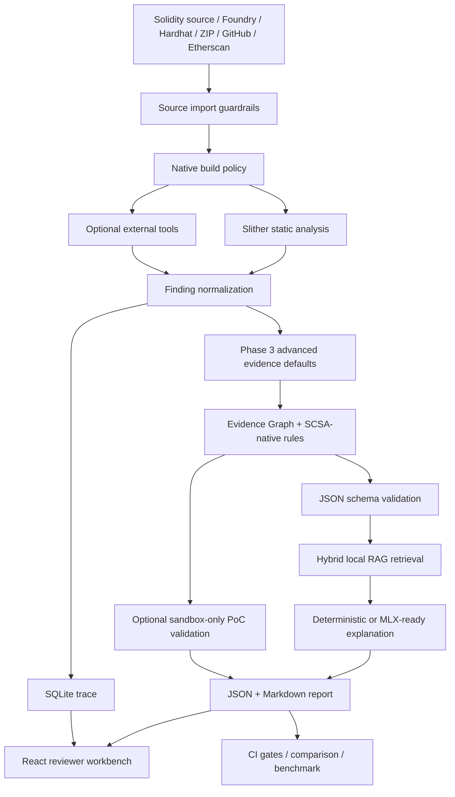

# Smart Contract Security Assistant (SCSA)

[](https://github.com/Eskasia/smart-contract-security-assistant/actions/workflows/ci.yml)
[](pyproject.toml)
[](LICENSE)
[](SECURITY.md)

Local-first analysis-artifact workbench for Solidity security triage.

SCSA turns deterministic analyzer output into reviewable security evidence: mapped Slither detector findings, optional external-tool signals, Evidence Graph nodes/edges/claims, sandbox-only exploit validation records, fuzz seed suggestions, formal property drafts, local RAG context, MLX-ready explanations, SQLite traces, JSON/Markdown reports, benchmark gates, and a React reviewer UI.

本專案協助維護者、審計學習者與小型 Solidity 團隊完成第一輪安全初篩。漏洞事實來自 Slither 與外部安全工具；LLM 只負責把既有 evidence 轉成可讀解釋、攻擊路徑與修復建議。

> Automated triage only. SCSA improves repeatability, evidence capture, and review handoff. Every report remains human-review required.

## Why SCSA Exists

Smart contract review often produces fragmented evidence: scanner JSON, terminal logs, failed fuzzing output, screenshots, Markdown notes, and reviewer comments. SCSA keeps those pieces in one local workflow so a reviewer can trace each finding from analyzer output to report, UI decision, and CI gate.

Core design:

- Evidence first: raw tool output, normalized findings, source ranges, tool signals, retrieved context, claims, generated explanations, and reviewer notes stay inspectable.
- Local-first artifacts: reports, traces, Evidence Graph rows, and generated review artifacts stay on the machine running the analysis; GitHub/Etherscan import and solc preparation may use network access when explicitly invoked.
- Deterministic before AI: LLM output explains findings; analyzer output remains the security fact source.
- Human in the loop: every report is a triage handoff for qualified review.
- CI-ready: report comparison, public benchmark, RAG eval, judge eval, frontend tests, and build checks can fail regressions.

## At A Glance

| Question | Answer |
|---|---|
| Primary use | Local Solidity finding triage before manual audit or pull-request review |
| Core analyzer | Slither |
| Optional tools | Aderyn, Echidna, Medusa, Mythril, Halmos |
| Inputs | `.sol`, Foundry, Hardhat, nested imports, GitHub archive, Etherscan mainnet/sepolia API allowlist, ZIP |
| Outputs | JSON report, Markdown report, SQLite trace, Evidence Graph tables, exploit validation records, fuzz/property suggestions, external-tool artifacts, Aderyn SARIF path |
| Interfaces | CLI, local HTTP API, React/Vite workbench, legacy Gradio UI |
| AI boundary | AI explains evidence; AI does not create vulnerability facts |
| Trust boundary | Imported sources are untrusted and force `native_build_policy=disabled`; trusted native build mode must be explicitly requested for local trusted projects |

## Third-Party Tooling and Attribution

SCSA is an evidence orchestration and review layer. It integrates with external
security tools, but it does not claim ownership of their detector, fuzzer,
symbolic-execution, or build engines.

External tools are optional unless explicitly marked as required. They are not
bundled in this repository unless stated otherwise. Each tool remains governed
by its own license.

See:

- [`THIRD_PARTY_NOTICES.md`](THIRD_PARTY_NOTICES.md)
- [`tool_matrix.yml`](tool_matrix.yml)
- [`docs/reference/tool-attribution.md`](docs/reference/tool-attribution.md)
- [`docs/reference/license-boundary.md`](docs/reference/license-boundary.md)
- [`docs/reference/related-work.md`](docs/reference/related-work.md)
- [`docs/reference/standards-mapping.md`](docs/reference/standards-mapping.md)

## Terminology

- Deterministic finding — a finding produced by a security analyzer or trusted tool output, not inferred directly by an LLM.
- RAG — local retrieval of relevant audit/context chunks before generating an explanation.
- MLX — Apple Silicon local model runtime used for optional local generation.
- SQLite trace — local database rows that preserve analyzer output, normalized findings, prompts, generation output, and review state.
- SARIF — static-analysis result format used by code scanning systems; SCSA tracks Aderyn SARIF as an artifact path.
- Native build policy — setting that controls whether Foundry/Hardhat build scripts may run for a source tree.
- Evidence Graph — SQLite-backed nodes, edges, and claims linking each finding to tool signal, source range, standards, RAG chunks, native rules, and reviewer status.
- Exploit validation — sandbox-only local validation record for triggerability and asset delta; it is disabled by default in normal analysis.
- Formal property suggestion — reviewer-only invariant or rule draft; it is not a proof until compiled and verified.

## Architecture



Knowledge graph spec: [`docs/knowledge-graph.md`](docs/knowledge-graph.md). Rebuild local graph artifacts with:

```bash
uv run python scripts/build_knowledge_graph.py
```

Generated files go to `knowledge-graph-out/`, which is intentionally ignored by Git.

## Relation To Security Tools

SCSA is an evidence and review layer around established analyzers. It does not
replace them, and its MIT license does not relicense external tools.

| Project | What it is known for | How SCSA uses or complements it |
|---|---|---|
| [Slither](https://github.com/crytic/slither) | Static analysis framework with detector and CI workflows | Primary analyzer source; only mapped detector output is promoted into formal report findings |
| [Aderyn](https://github.com/Cyfrin/aderyn) | Solidity static analyzer with Markdown/JSON/SARIF reports | Optional static finding signal and SARIF artifact tracking |
| [Echidna](https://github.com/crytic/echidna) | Property-based smart contract fuzzing | Optional invariant/property failure signal |
| [Medusa](https://github.com/crytic/medusa) | Parallelized coverage-guided Solidity fuzzing | Optional fuzzer failure signal |
| [Mythril](https://github.com/ConsenSysDiligence/mythril) | Symbolic execution for EVM bytecode | Optional symbolic issue signal |
| [Halmos](https://github.com/a16z/halmos) | Symbolic testing for EVM smart contracts | Optional trusted Foundry proof-failure signal |

## Supported Finding Promotion Scope

SCSA promotes only mapped Slither detector output into formal report findings.
Unmapped Slither detector output is retained in trace evidence and is not
treated as a report finding until mapped. The current mapped detector subset is:

| Internal type | Slither detectors |
|---|---|
| `reentrancy` | `reentrancy-eth`, `reentrancy-no-eth`, `reentrancy-benign` |
| `upgrade_risk` | `unprotected-upgrade`, `uninitialized-state`, `uninitialized-storage`, `missing-inheritance` |
| `access_control` | `suicidal`, `arbitrary-send-eth` |
| `privilege_escalation` | `arbitrary-send-erc20`, `arbitrary-send-erc20-permit`, `tx-origin`, `protected-vars` |
| `unchecked_external_call` | `unchecked-lowlevel`, `unchecked-send`, `unchecked-transfer`, `unused-return` |
| `dangerous_delegatecall` | `controlled-delegatecall`, `delegatecall-loop` |
| `array_length_manipulation` | `controlled-array-length` |
| `price_manipulation` | `divide-before-multiply`, `incorrect-equality`, `timestamp` |
| `oracle` | `weak-prng`, `incorrect-exp`, `pyth-unchecked-confidence`, `pyth-unchecked-publishtime` |

## Who This Is For

- Solidity developers performing pre-audit checks.
- Open-source maintainers reviewing Solidity pull requests.
- Web3 teams that need repeatable local security triage.
- Audit learners who want traceable examples of findings and explanations.
- Small audit teams that need structured report handoff before deeper review.

## Installation

Install from a source checkout for local development:

```bash
git clone https://github.com/Eskasia/smart-contract-security-assistant.git
cd smart-contract-security-assistant
uv sync --extra audit --dev
uv run scsa --help
```

Install the current GitHub source as a CLI package:

```bash
python -m pip install \
  "smart-contract-security-assistant[audit] @ git+https://github.com/Eskasia/smart-contract-security-assistant.git"
scsa --help
```

Future package note: PyPI publishing is not enabled yet. After an approved PyPI
release exists, the expected install command is:

```bash
python -m pip install "smart-contract-security-assistant[audit]"
```

Do not count PyPI downloads as adoption evidence until a public package release
and package-hosted download counter exist.

## Quick Start

Prerequisites:

- Python `>=3.11`
- `uv`
- A compatible `solc` version for the target contract

```bash
uv sync --extra audit --dev
uv run scsa analyze tests/contracts/VulnerableVault.sol --out-dir reports-demo --native-build-policy disabled
uv run pytest
```

Expected fixture summary:

```text
overall_status: finding
finding: f_001 | reentrancy | severity 3 | withdraw | SWC-107
human_review_required: true
```

Generated artifacts:

```text
reports-demo/<contract_id>.json
reports-demo/<contract_id>.md
reports-demo/analysis_trace.sqlite
```

## Example Finding

`tests/contracts/VulnerableVault.sol` intentionally writes state after an external call:

```solidity
function withdraw() external {
    uint256 amount = balances[msg.sender];
    (bool success, ) = msg.sender.call{value: amount}("");
    require(success, "transfer failed");
    balances[msg.sender] = 0;
}
```

The generated report records the normalized finding, source location, detector evidence, SWC/OWASP/SCSVS/SCWE standard references when mapped, attack path, fix suggestion, tool source, confidence fields, trace id, and review status.

## Web Workbench

Start the local API:

```bash
uv run scsa api \
  --host 127.0.0.1 \
  --port 8787 \
  --out-dir reports-api \
  --input-root "$PWD" \
  --api-token dev-token \
  --cors-origin http://127.0.0.1:5173 \
  --max-request-bytes 1048576 \
  --max-concurrent-jobs 4 \
  --max-events-per-job 256 \
  --max-report-bytes 5000000 \
  --native-build-policy disabled
```

API `/api/*` requests require `--api-token` by default. Tokenless local demos
must opt in with `--allow-tokenless-local-demo`; analysis paths outside
`--input-root` must opt in with `--allow-any-input-root`.

Start the frontend:

```bash
cd frontend
npm install
npm run dev
```

Open `http://127.0.0.1:5173`.

The workbench supports source import, analysis submit, SSE/polling status, external-tool selection, finding review, trace evidence lookup, report deep links, remediation diff review, JSON/Markdown downloads, and artifact path inspection. API tokens are kept in frontend memory state and are not persisted to `localStorage`.

## CLI Cookbook

```bash
# Analyze a single contract or project with native builds disabled by default
uv run scsa analyze <contract.sol|project-dir> --out-dir reports

# Keep imported or untrusted projects on the safe default
uv run scsa analyze <contract.sol|project-dir> --out-dir reports --native-build-policy disabled

# Attach optional external tools when their binaries are installed
uv run scsa analyze <contract.sol|project-dir> --out-dir reports \
  --external-tool aderyn \
  --external-tool echidna \
  --external-tool medusa \
  --external-tool mythril

# Enable trusted native build mode only for an explicitly trusted Foundry project.
# This executes project build scripts and is a high-risk operation for untrusted code.
uv run scsa analyze <foundry-project-dir> --out-dir reports \
  --native-build-policy trusted \
  --external-tool halmos

# Import a GitHub repository into a guarded local staging directory
uv run scsa import-source \
  --github-url https://github.com/OpenZeppelin/openzeppelin-contracts \
  --out-dir reports-api/imports

# Import verified contract source from the default Etherscan mainnet/sepolia allowlist
uv run scsa import-source \
  --etherscan-api-host api.etherscan.io \
  --address 0x0000000000000000000000000000000000000000 \
  --out-dir reports-api/imports

# Remove expired guarded source-import staging directories
uv run scsa clean-imports --imports-dir reports-api/imports --ttl-seconds 86400

# Compare two reports for CI regression gates
uv run scsa compare-reports reports/base.json reports/head.json \
  --output reports/comparison.md \
  --fail-on-high-added \
  --fail-on-score-drop 10

# Inspect trace evidence
uv run scsa trace-lookup reports/analysis_trace.sqlite <trace_id>
uv run scsa trace-lookup reports/analysis_trace.sqlite <trace_id> --finding-id f_001
uv run scsa trace-dashboard reports/analysis_trace.sqlite

# Suggest reviewer-only formal properties from an existing report
uv run scsa properties suggest reports/<contract_id>.json \
  --format foundry-invariant \
  --out reports/properties

# Probe local MLX runtime availability
uv run scsa mlx-probe --auto-discover-model --output reports-mlx/mlx_probe.json

# Create and attach an optional 0G audit proof package
uv run scsa 0g-package reports/<contract_id>.json --out-dir reports-0g
uv run scsa 0g-attach-proof reports/<contract_id>.json reports-0g/<contract_id>/audit-proof.json
```

Optional extras:

```bash
uv sync --extra audit --extra docs --extra rag --extra mlx --extra web --dev
```

## Output Contract

| Output | Purpose |
|---|---|
| JSON report | Machine-readable findings, standards mapping, evidence graph summary, score, metadata, review state, and external-tool summaries |
| Markdown report | Human-readable audit triage handoff with standards, native rules, and groundedness per finding |
| SQLite trace | Raw analyzer output, Evidence Graph nodes/edges/claims, exploit validation rows, normalized finding, RAG chunks, prompt, generation output, and review notes |
| Phase 3 artifacts | Sandbox-only PoC validation JSON/logs, fuzz seed notes, formal property drafts, and EVMbench detect/exploit adapter summaries |
| External-tool artifacts | Tool-specific JSON/text output, execution mode, binary path, command, timeout, duration, status, and SARIF artifact paths |
| Comparison report | Added, fixed, and persistent findings across two reports |
| 0G proof package | Optional report hash/proof metadata package for hackathon or external verification workflows |

The public JSON report schema is [`schema/report.schema.json`](schema/report.schema.json).
It is generated from `smart_contract_audit.validation.schema.REPORT_SCHEMA`;
CI checks it with `uv run python scripts/sync_report_schema.py --check`.

## Security Boundaries

- Only scan contracts that you own, maintain, or are explicitly authorized to review.
- Do not upload private keys, secrets, customer contracts, proprietary audit reports, or unauthorized third-party code.
- `POST /api/imports` rejects path traversal, symlink entries, special files, nested archives, unsafe redirects, non-allowlisted hosts, and oversized remote responses.
- Imported sources are treated as untrusted and always run with `native_build_policy=disabled`.
- The HTTP API requires bearer token auth for `/api/*` by default, fail-closes on non-local hosts without `--api-token`, rejects mismatched request origins, rejects non-JSON write bodies, rejects token-authenticated wildcard CORS, and supports fixed CORS origin, `input_root`, explicit tokenless local demo opt-in, explicit any-input-root opt-in, request body limit, import size limits, job concurrency cap, event buffer cap, report read size cap, and server-side native build policy ceiling.
- Halmos requires trusted Foundry project mode; untrusted/imported sources cannot enable that flow.
- Generated explanations can be incomplete or wrong; use trace rows and analyzer evidence as the review anchor.

## Validation

v0.2.1 hardening readiness verification on 2026-06-01:

```text
branch: hardening/phase-0-integration
GitHub Actions run ID: pending until the v0.2.1 hardening PR is opened
```

```text
uv sync --extra audit --dev          resolved 198 packages, checked 83 packages
uv run ruff check .                  all checks passed
uv run pytest                        138 passed
uv run python scripts/sync_report_schema.py --check  passed
uv run python scripts/check_tool_matrix.py  passed
uv run python scripts/generate_sbom.py      generated tool-matrix SBOM and license inventory
cd frontend && npm ci                installed 274 packages, audited 275 packages, 0 vulnerabilities
cd frontend && npm run test -- --run 35 passed
cd frontend && npm run build         completed
git diff --check                     passed
```

CI gates:

```bash
uv run python scripts/check_tool_matrix.py
uv run python scripts/generate_sbom.py
uv run python scripts/sync_report_schema.py --check
uv run ruff check .
uv run pytest
uv run python eval/run_eval.py
uv run python eval/run_judge.py
uv run python eval/run_paired_variants.py --min-paired-pass-rate 0.70
uv run python eval/run_rag_groundedness.py --max-unsupported-security-claims 0
uv run python eval/run_exploit_validation.py
uv run python eval/run_fuzz_seed_suggestions.py --min-seed-count 1
uv run python eval/run_formal_property_suggestions.py --min-property-count 1
uv run python eval/run_evmbench_adapter.py
uv run python eval/run_public_benchmark.py --min-supported-hit-rate 0.95 --min-score-gap 30 --min-recall 0.5 --min-f1 0.5
uv run python eval/run_public_project_builds.py --preflight-only
cd frontend && npm run test -- --run
cd frontend && npm run build
git diff --check
```

Latest recorded public benchmark summary: 50 cases, 100.00% supported-label hit rate, 86.21% precision, 100.00% recall, and 92.59% F1. Phase 2 paired variants currently cover 15 pairs across 5 vulnerability types with `paired_pass_rate = 1.0`; groundedness eval requires `unsupported_security_claims = 0`. See [`docs/reference/002-public-benchmark-leaderboard.md`](docs/reference/002-public-benchmark-leaderboard.md) and [`docs/reference/benchmark-reproducibility.md`](docs/reference/benchmark-reproducibility.md).

## GitHub Actions

- `.github/workflows/ci.yml` runs tool attribution checks, compliance artifact generation, lint, tests, RAG eval, judge eval, paired variant benchmark, groundedness eval, sandbox exploit validation, fuzz/property suggestion evals, EVMbench adapter, public benchmark, public project build preflight, frontend test/build, and whitespace checks on pushes and pull requests.
- CI produces compliance artifacts plus `reports/eval/benchmark_matrix.json`, `reports/eval/benchmark_summary.md`, `reports/eval/paired_variant_results.json`, `reports/eval/rag_groundedness.json`, EVMbench adapter outputs, sandbox PoC logs, fuzz seed notes, and property suggestion artifacts.
- `.github/workflows/smart-contract-audit.yml` provides a manual audit workflow that runs `scsa analyze`, optionally compares against a baseline report, and uploads generated reports as the `scsa-reports` artifact.

## Limitations

- Business-logic, economic-mechanism, oracle, cross-contract, governance, MEV, and flash-loan risks require human review.
- External-tool precision depends on installed binaries, project buildability, detector coverage, and configured timeout.
- Native Foundry/Hardhat builds execute project scripts; keep untrusted native builds disabled.
- Local RAG quality depends on the dataset chunks available on the operator machine.
- MLX generation requires a compatible Apple Silicon runtime and model; deterministic fallback remains valid when no local model is available.
- SCSA cannot certify a third-party codebase as safe to deploy.

## Project Docs

- [`CHANGELOG.md`](CHANGELOG.md)
- [`CONTRIBUTING.md`](CONTRIBUTING.md)
- [`SECURITY.md`](SECURITY.md)
- [`CODE_OF_CONDUCT.md`](CODE_OF_CONDUCT.md)
- [`THIRD_PARTY_NOTICES.md`](THIRD_PARTY_NOTICES.md)
- [`docs/DOCS_INDEX.md`](docs/DOCS_INDEX.md)
- [`docs/maintainer-workflow.md`](docs/maintainer-workflow.md)
- [`docs/adoption/codex-for-oss-evidence.md`](docs/adoption/codex-for-oss-evidence.md)
- [`docs/guides/001-usage-manual.md`](docs/guides/001-usage-manual.md)
- [`docs/design/001-project-architecture.md`](docs/design/001-project-architecture.md)
- [`docs/design/005-ui-design-system.md`](docs/design/005-ui-design-system.md)
- [`docs/knowledge-graph.md`](docs/knowledge-graph.md)
- [`docs/reference/tool-attribution.md`](docs/reference/tool-attribution.md)
- [`docs/reference/license-boundary.md`](docs/reference/license-boundary.md)
- [`docs/reference/related-work.md`](docs/reference/related-work.md)
- [`docs/reference/standards-mapping.md`](docs/reference/standards-mapping.md)
- [`docs/reference/phase3-advanced-evidence.md`](docs/reference/phase3-advanced-evidence.md)
- [`docs/reference/002-public-benchmark-leaderboard.md`](docs/reference/002-public-benchmark-leaderboard.md)

## Tester Feedback Wanted

v0.2.0 is published. The v0.1.0 feedback issue #12 remains available for
historical quickstart feedback only; v0.2.0 feedback should use a new GitHub
issue linked from the release notes.

https://github.com/Eskasia/smart-contract-security-assistant/issues/12

## Contributing

See [`CONTRIBUTING.md`](CONTRIBUTING.md) for setup, validation, pull request expectations, and issue triage guidance. See [`SECURITY.md`](SECURITY.md) before reporting vulnerabilities or unsafe behavior in the tool itself.
