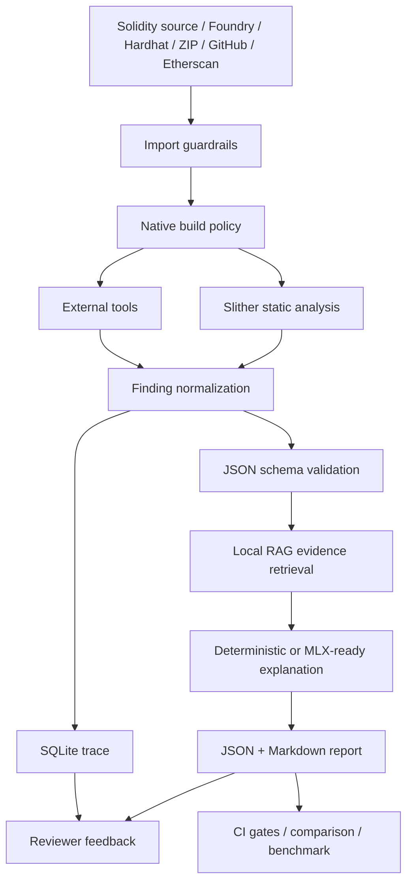

# Smart Contract Security Assistant

[](https://github.com/Eskasia/smart-contract-security-assistant/actions/workflows/ci.yml)
[](pyproject.toml)
[](LICENSE)
[](SECURITY.md)

Local-first Solidity security triage workbench that turns analyzer output into reviewable evidence: Slither findings, optional external-tool signals, local RAG context, MLX-ready explanations, SQLite traces, JSON/Markdown reports, and a React reviewer UI.

本專案協助維護者、審計學習者與小型 Solidity 團隊做第一輪安全初篩。LLM 只負責把 deterministic findings 轉成可讀解釋、攻擊路徑與修復建議；漏洞判定來源仍以 Slither 與外部安全工具輸出為準。

> Automated triage only. This tool improves repeatability and evidence capture, but it does not replace a qualified manual smart contract audit.

## At A Glance

| Question | Answer |
|---|---|
| Primary use | Local Solidity finding triage before human audit or PR review |
| Core analyzer | Slither |
| Optional tools | Mythril, Echidna, Aderyn, Medusa, Halmos |
| Inputs | `.sol`, Foundry, Hardhat, nested imports, GitHub archive, Etherscan API, ZIP |
| Outputs | JSON report, Markdown report, SQLite trace, Aderyn SARIF artifact path |
| UI | React/Vite evidence-first reviewer workbench |
| CI | Ruff, pytest, RAG eval, judge eval, public benchmark, frontend test/build |

## Relation To Security Tools

SCSA is not a replacement for established analyzers. It is a local evidence and review layer that orchestrates their outputs.

| Project | What it is known for | How SCSA uses or complements it |
|---|---|---|
| [Slither](https://github.com/crytic/slither) | Static analysis framework with detector and CI workflows | Primary deterministic finding source and detector mapping |
| [Echidna](https://github.com/crytic/echidna) | Property-based smart contract fuzzing | Optional invariant/property failure signal |
| [Medusa](https://github.com/crytic/medusa) | Parallelized coverage-guided Solidity fuzzing | Optional fuzzer failure signal |
| [Aderyn](https://github.com/Cyfrin/aderyn) | Solidity static analyzer with Markdown/JSON/SARIF reports | Optional static finding signal and SARIF artifact tracking |
| [Mythril](https://github.com/ConsenSysDiligence/mythril) | Symbolic execution for EVM bytecode | Optional symbolic issue signal |
| [Halmos](https://github.com/a16z/halmos) | Symbolic testing for EVM smart contracts | Optional trusted Foundry proof-failure signal |

## Why This Exists

- **Evidence first**: raw analyzer output, normalized findings, prompt context, trace rows and reviewer notes stay inspectable.
- **Local first**: source code and generated reports remain on the machine running the analysis.
- **Tool orchestration**: external tools are recorded as structured signals instead of mixed into one opaque AI answer.
- **Reviewer workflow**: findings can be selected, traced, marked, exported and compared across scans.
- **CI-ready gates**: benchmark checks, public project build preflight and report comparison can fail unsafe regressions.

## Architecture



Knowledge graph spec: [`docs/knowledge-graph.md`](docs/knowledge-graph.md). Local artifact rebuild:

```bash
uv run python scripts/build_knowledge_graph.py
```

Generated files go to `knowledge-graph-out/`, which is intentionally ignored by Git.

## Quick Start

Prerequisites:

- Python `>=3.11`
- `uv`
- A compatible `solc` version for the target contract

```bash
uv sync --extra audit --dev
uv run scsa analyze tests/contracts/VulnerableVault.sol --out-dir reports-demo --native-build-policy disabled
uv run pytest
```

Expected fixture summary:

```text
overall_status: finding
finding: f_001 | reentrancy | severity 3 | withdraw | SWC-107
human_review_required: true
```

Generated artifacts:

- `reports-demo/<contract_id>.json`
- `reports-demo/<contract_id>.md`
- `reports-demo/analysis_trace.sqlite`

## Web Workbench

```bash
uv run scsa api \
  --host 127.0.0.1 \
  --port 8787 \
  --out-dir reports-api \
  --input-root "$PWD" \
  --api-token dev-token \
  --cors-origin http://127.0.0.1:5173 \
  --max-request-bytes 1048576 \
  --native-build-policy disabled

cd frontend
npm install
npm run dev
```

Open `http://127.0.0.1:5173`. The workbench supports source import, analysis submit, SSE/polling status, finding review, trace evidence, report deep links, JSON/Markdown downloads and a four-tool selector.

## Example Finding

`tests/contracts/VulnerableVault.sol` intentionally writes state after an external call:

```solidity
function withdraw() external {
    uint256 amount = balances[msg.sender];
    (bool success, ) = msg.sender.call{value: amount}("");
    require(success, "transfer failed");
    balances[msg.sender] = 0;
}
```

The generated report records the normalized finding, source location, detector evidence, SWC reference, attack path, fix suggestion, tool source, confidence fields and review status.

## CLI Cookbook

```bash
# Analyze a single contract or project
uv run scsa analyze <contract.sol|project-dir> --out-dir reports

# Attach external tools when their binaries are installed
uv run scsa analyze <contract.sol|project-dir> --out-dir reports \
  --external-tool aderyn \
  --external-tool echidna \
  --external-tool medusa

# Import remote source into a guarded local staging directory
uv run scsa import-source \
  --github-url https://github.com/OpenZeppelin/openzeppelin-contracts \
  --out-dir reports-api/imports

# Compare two reports for CI regression gates
uv run scsa compare-reports reports/base.json reports/head.json \
  --output reports/comparison.md \
  --fail-on-high-added \
  --fail-on-score-drop 10

# Inspect trace evidence
uv run scsa trace-lookup reports/analysis_trace.sqlite <trace_id>
uv run scsa trace-dashboard reports/analysis_trace.sqlite

# Probe local MLX runtime availability
uv run scsa mlx-probe --auto-discover-model --output reports-mlx/mlx_probe.json
```

Optional extras:

```bash
uv sync --extra audit --extra docs --extra rag --extra mlx --extra web --dev
```

## Output Contract

| Output | Purpose |
|---|---|
| JSON report | Machine-readable findings, score, metadata, review state and external-tool summaries |
| Markdown report | Human-readable audit triage handoff |
| SQLite trace | Raw analyzer output, normalized finding, RAG chunks, prompt, LLM output and review notes |
| SARIF artifact path | Aderyn SARIF location without embedding large SARIF payloads in main report JSON |

## Security Boundaries

- Only scan contracts that you own, maintain or are explicitly authorized to review.
- `POST /api/imports` rejects path traversal, symlink entries, special files, nested archives, unsafe redirects, non-allowlisted hosts and oversized remote responses.
- Imported sources are treated as untrusted and analyzed with `native_build_policy=disabled` unless explicitly trusted by the caller.
- HTTP API supports bearer token, fixed CORS origin, `input_root`, request body limit and server-side native build policy ceiling.
- API token stays in memory state on the frontend and is not persisted to `localStorage`.
- Halmos requires trusted Foundry project mode; untrusted/imported sources cannot enable that flow.

## Validation

Last full local verification on 2026-05-31:

```text
uv run pytest -q                     106 passed
uv run ruff check .                  all checks passed
cd frontend && npm run test -- --run 35 passed
cd frontend && npm run build         completed
git diff --check                     passed
```

Benchmark gates:

```bash
uv run python eval/run_eval.py
uv run python eval/run_judge.py
uv run python eval/run_public_benchmark.py --min-supported-hit-rate 0.95 --min-score-gap 30 --min-recall 0.5 --min-f1 0.5
uv run python eval/run_public_project_builds.py --preflight-only
```

## Limitations

- Business-logic, economic-mechanism, oracle, cross-contract and flash-loan risks require human review.
- Generated explanations can be incomplete or wrong; use the trace and analyzer evidence as the review anchor.
- Real external tool precision depends on installed binaries, project buildability and configured timeout.
- SCSA does not make a third-party codebase safe to execute; keep untrusted native builds disabled.

## Community And Project Docs

- [`CHANGELOG.md`](CHANGELOG.md)
- [`CONTRIBUTING.md`](CONTRIBUTING.md)
- [`SECURITY.md`](SECURITY.md)
- [`CODE_OF_CONDUCT.md`](CODE_OF_CONDUCT.md)
- [`docs/DOCS_INDEX.md`](docs/DOCS_INDEX.md)
- [`docs/guides/001-usage-manual.md`](docs/guides/001-usage-manual.md)
- [`docs/design/001-project-architecture.md`](docs/design/001-project-architecture.md)
- [`docs/design/005-ui-design-system.md`](docs/design/005-ui-design-system.md)
- [`docs/knowledge-graph.md`](docs/knowledge-graph.md)
- [`docs/release/001-v0.1.0-checklist.md`](docs/release/001-v0.1.0-checklist.md)
- [`docs/community/001-v0.1.0-tester-feedback.md`](docs/community/001-v0.1.0-tester-feedback.md)
- [`docs/reference/002-public-benchmark-leaderboard.md`](docs/reference/002-public-benchmark-leaderboard.md)

## Tester Feedback Wanted

Smart Contract Security Assistant v0.1.0 is collecting independent quickstart feedback from Solidity/Web3 users. If you can run the fixture locally, please leave your environment, command result and usability feedback in issue #12:
https://github.com/Eskasia/smart-contract-security-assistant/issues/12

## GitHub Actions

`.github/workflows/ci.yml` runs lint, tests, eval gates, public benchmark, frontend build and whitespace checks on PRs. `.github/workflows/smart-contract-audit.yml` provides a manual audit workflow that uploads generated reports as the `scsa-reports` artifact.

## Contributing

See [`CONTRIBUTING.md`](CONTRIBUTING.md) for setup, validation, pull request expectations and issue triage guidance. See [`SECURITY.md`](SECURITY.md) before reporting vulnerabilities or unsafe behavior in the tool itself.
