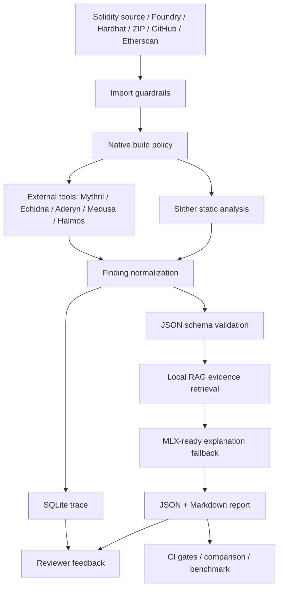

# Smart Contract Security Assistant

[](https://github.com/Eskasia/smart-contract-security-assistant/actions/workflows/ci.yml)

本專案是一個本地優先的 Solidity 安全初篩工作台。它把 Slither、可選外部安全工具、本地 RAG、MLX-ready 生成、SQLite trace 與 React triage UI 串成一條可重現的審計輔助流程，輸出 JSON、Markdown、SARIF artifact path 與逐條 finding review 狀態。

> Automated triage only. This tool improves repeatability and evidence capture, but it does not replace a qualified manual smart contract audit.

English README: [`README.en.md`](README.en.md)

## Why This Exists

- **Local-first evidence**：source、finding、prompt、trace、review note 與 report artifact 都留在本地目錄。
- **Security-tool orchestration**：以 Slither 為核心，支援 Mythril、Echidna、Aderyn、Medusa、Halmos 的可選結果匯入。
- **Reviewer workflow**：前端提供 finding triage、trace evidence、remediation diff、report review 與 JSON/Markdown 下載。
- **CI-ready gates**：內建 benchmark、public project build preflight、report comparison 與 GitHub Actions workflow。

## Knowledge Graph



圖譜規格在 [`docs/knowledge-graph.md`](docs/knowledge-graph.md)。本機可重建 artifact：

```bash
uv run python scripts/build_knowledge_graph.py
```

輸出會寫入 `knowledge-graph-out/`，該目錄只留本地，不追蹤到 GitHub。

## Quick Start

```bash
uv sync --extra audit --dev
uv run scsa analyze tests/contracts/VulnerableVault.sol --out-dir reports --native-build-policy disabled
uv run pytest
```

常用輸出：

- `reports/<contract_id>.json`
- `reports/<contract_id>.md`
- `reports/analysis_trace.sqlite`

## Web Workbench

```bash
uv run scsa api \
  --host 127.0.0.1 \
  --port 8787 \
  --out-dir reports-api \
  --input-root "$PWD" \
  --api-token dev-token \
  --cors-origin http://127.0.0.1:5173 \
  --max-request-bytes 1048576 \
  --native-build-policy disabled

cd frontend
npm install
npm run dev
```

開啟 `http://127.0.0.1:5173`。前端透過 Vite proxy 呼叫 `http://127.0.0.1:8787`，提供 source import、analysis submit、SSE/polling status、finding review、trace evidence、report deep link、JSON/Markdown download 與四工具 selector。

## CLI Commands

```bash
uv run scsa analyze <contract.sol|project-dir> --out-dir reports
uv run scsa analyze <contract.sol|project-dir> --out-dir reports --external-tool aderyn --external-tool echidna
uv run scsa import-source --github-url https://github.com/OpenZeppelin/openzeppelin-contracts --out-dir reports-api/imports
uv run scsa compare-reports reports/base.json reports/head.json --output reports/comparison.md --fail-on-high-added --fail-on-score-drop 10
uv run scsa trace-lookup reports/analysis_trace.sqlite <trace_id>
uv run scsa trace-dashboard reports/analysis_trace.sqlite
uv run scsa mlx-probe --auto-discover-model --output reports-mlx/mlx_probe.json
uv run python scripts/build_knowledge_graph.py
```

## Capability Matrix

| Area | Current support |
|---|---|
| Input | Single `.sol`, Foundry, Hardhat, nested Solidity imports, GitHub archive, Etherscan API, ZIP base64 |
| Analysis | Slither detector mapping, external tool result normalization, local RAG, deterministic/MLX-ready explanation |
| External tools | Mythril, Echidna, Aderyn, Medusa, Halmos; missing binaries are recorded as skipped |
| Trust policy | Imported sources are untrusted; `native_build_policy=disabled` skips build scripts and uses Slither/solc fallback |
| Report | Security score, vulnerable snippet, explanation, attack path, fix suggestion, remediation diff, judge score, token usage |
| Trace | Raw Slither output, normalized finding, RAG chunks, prompt, LLM output, review status, review note |
| Frontend | Evidence-first triage console with shared design tokens and responsive layout |
| CI | Ruff, pytest, RAG eval, judge eval, public benchmark, public project preflight, frontend test/build, whitespace check |

## Security Boundaries

- `POST /api/imports` rejects path traversal, symlink entries, special files, nested archives, unsafe redirects, non-allowlisted hosts and oversized remote responses.
- HTTP API supports bearer token, fixed CORS origin, `input_root`, request body limit and server-side native build policy ceiling.
- API token stays in memory state on the frontend and is not persisted to `localStorage`.
- Halmos requires trusted Foundry project mode; untrusted/imported sources cannot enable that flow.

## Validation

Last full local verification on 2026-05-31:

```text
uv run pytest -q                     106 passed
uv run ruff check .                  all checks passed
cd frontend && npm run test -- --run 35 passed
cd frontend && npm run build         completed
git diff --check                     passed
```

Benchmark gates:

```bash
uv run python eval/run_eval.py
uv run python eval/run_judge.py
uv run python eval/run_public_benchmark.py --min-supported-hit-rate 0.95 --min-score-gap 30 --min-recall 0.5 --min-f1 0.5
uv run python eval/run_public_project_builds.py --preflight-only
```

## Documentation

- [`docs/guides/001-usage-manual.md`](docs/guides/001-usage-manual.md)：installation、API、trace、external tools、GitHub Actions。
- [`docs/design/001-project-architecture.md`](docs/design/001-project-architecture.md)：module boundary、data flow、storage。
- [`docs/design/005-ui-design-system.md`](docs/design/005-ui-design-system.md)：evidence-first UI tokens and component rules。
- [`docs/knowledge-graph.md`](docs/knowledge-graph.md)：capability/evidence graph and rebuild command。
- [`docs/reference/002-public-benchmark-leaderboard.md`](docs/reference/002-public-benchmark-leaderboard.md)：public benchmark result table。

## GitHub Actions

`.github/workflows/ci.yml` runs lint, tests, eval gates, public benchmark, frontend build and whitespace checks on PRs. `.github/workflows/smart-contract-audit.yml` provides a manual audit workflow that uploads generated reports as the `scsa-reports` artifact.
