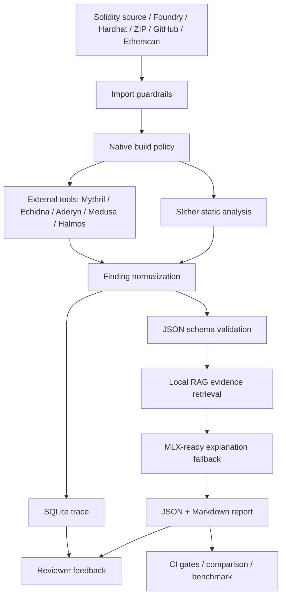

# Smart Contract Security Assistant

[](https://github.com/Eskasia/smart-contract-security-assistant/actions/workflows/ci.yml)

Local-first Solidity security triage assistant with Slither, optional external audit tools, local RAG context, MLX-ready generation, a React reviewer workbench, and traceable JSON/Markdown/SQLite outputs.

本專案協助維護者、審計學習者與小型 Solidity 團隊做第一輪安全初篩。LLM 只負責把 deterministic findings 轉成可讀解釋、攻擊路徑與修復建議；漏洞判定來源仍以 Slither 與外部安全工具輸出為準。

> Automated triage only. This tool improves repeatability and evidence capture, but it does not replace a qualified manual smart contract audit.

English README: [`README.en.md`](README.en.md)

## Who This Is For

- OSS maintainers reviewing Solidity pull requests.
- Small audit teams that need reproducible local triage before human review.
- Hackathon or prototype teams checking obvious contract risks before release.
- Learners who want traceable examples of Slither findings and explanations.

## Authorized-Use Boundary

Only scan contracts that you own, maintain, or are explicitly authorized to review.

Do not use this project to scan private repositories, proprietary contracts, customer audit material, or third-party code without permission. Do not include private keys, secrets, customer data, or unpublished third-party reports in issues, traces, examples, or pull requests.

## Tester Feedback Wanted

Smart Contract Security Assistant v0.1.0 is collecting independent quickstart feedback from Solidity/Web3 users. If you can run the fixture locally, please leave your environment, command result, and usability feedback in issue #12:
https://github.com/Eskasia/smart-contract-security-assistant/issues/12

## Why This Exists

- **Local-first evidence**: source, finding, prompt, trace, review note and report artifacts stay in local directories.
- **Security-tool orchestration**: Slither is the core analyzer; Mythril, Echidna, Aderyn, Medusa and Halmos can be attached when installed.
- **Reviewer workflow**: the frontend supports finding triage, trace evidence, remediation diff, report review and JSON/Markdown downloads.
- **CI-ready gates**: benchmark checks, public project build preflight, report comparison and GitHub Actions workflows are included.

## Knowledge Graph



Graph spec: [`docs/knowledge-graph.md`](docs/knowledge-graph.md). Local artifact rebuild:

```bash
uv run python scripts/build_knowledge_graph.py
```

Generated files go to `knowledge-graph-out/`, which is intentionally ignored by Git.

## Quick Start

Prerequisites:

- Python `>=3.11`
- `uv`
- A compatible `solc` version for the target contract

```bash
uv sync --extra audit --dev
uv run scsa analyze tests/contracts/VulnerableVault.sol --out-dir reports-demo --native-build-policy disabled
uv run pytest
```

The demo command writes:

- `reports-demo/<contract_id>.json`
- `reports-demo/<contract_id>.md`
- `reports-demo/analysis_trace.sqlite`

Expected summary for the fixture:

```text
overall_status: finding
finding: f_001 | reentrancy | severity 3 | withdraw | SWC-107
human_review_required: true
```

## Web Workbench

```bash
uv run scsa api \
  --host 127.0.0.1 \
  --port 8787 \
  --out-dir reports-api \
  --input-root "$PWD" \
  --api-token dev-token \
  --cors-origin http://127.0.0.1:5173 \
  --max-request-bytes 1048576 \
  --native-build-policy disabled

cd frontend
npm install
npm run dev
```

Open `http://127.0.0.1:5173`. The React UI provides source import, analysis submit, SSE/polling status, finding review, trace evidence, report deep link, JSON/Markdown download and four-tool selector.

## Example Output

`tests/contracts/VulnerableVault.sol` intentionally writes state after an external call:

```solidity
function withdraw() external {
    uint256 amount = balances[msg.sender];
    (bool success, ) = msg.sender.call{value: amount}("");
    require(success, "transfer failed");
    balances[msg.sender] = 0;
}
```

The generated Markdown report includes a normalized finding, source location, evidence, SWC reference, confidence fields, attack path, fix suggestion, tool source and analysis metadata.

## Commands

```bash
uv run scsa analyze <contract.sol|project-dir> --out-dir reports
uv run scsa analyze <contract.sol|project-dir> --out-dir reports --external-tool aderyn --external-tool echidna
uv run scsa import-source --github-url https://github.com/OpenZeppelin/openzeppelin-contracts --out-dir reports-api/imports
uv run scsa compare-reports reports/base.json reports/head.json --output reports/comparison.md --fail-on-high-added --fail-on-score-drop 10
uv run scsa trace-lookup reports/analysis_trace.sqlite <trace_id>
uv run scsa trace-dashboard reports/analysis_trace.sqlite
uv run scsa mlx-probe --auto-discover-model --output reports-mlx/mlx_probe.json
uv run python scripts/build_knowledge_graph.py
```

Optional extras:

```bash
uv sync --extra audit --extra docs --extra rag --extra mlx --extra web --dev
```

## Capability Matrix

| Area | Current support |
|---|---|
| Input | Single `.sol`, Foundry, Hardhat, nested Solidity imports, GitHub archive, Etherscan API, ZIP base64 |
| Analysis | Slither detector mapping, external tool result normalization, local RAG, deterministic/MLX-ready explanation |
| External tools | Mythril, Echidna, Aderyn, Medusa, Halmos; missing binaries are recorded as skipped |
| Trust policy | Imported sources are untrusted; `native_build_policy=disabled` skips build scripts and uses Slither/solc fallback |
| Report | Security score, vulnerable snippet, explanation, attack path, fix suggestion, remediation diff, judge score, token usage |
| Trace | Raw Slither output, normalized finding, RAG chunks, prompt, LLM output, review status, review note |
| Frontend | Evidence-first triage console with shared design tokens and responsive layout |
| CI | Ruff, pytest, RAG eval, judge eval, public benchmark, public project preflight, frontend test/build, whitespace check |

## Security Boundaries

- `POST /api/imports` rejects path traversal, symlink entries, special files, nested archives, unsafe redirects, non-allowlisted hosts and oversized remote responses.
- HTTP API supports bearer token, fixed CORS origin, `input_root`, request body limit and server-side native build policy ceiling.
- API token stays in memory state on the frontend and is not persisted to `localStorage`.
- Halmos requires trusted Foundry project mode; untrusted/imported sources cannot enable that flow.

## Limitations

- Business-logic, economic-mechanism, oracle, cross-contract and flash-loan risks require human review.
- Generated explanations can be incomplete or wrong; use the trace and analyzer evidence as the review anchor.
- Real external tool precision depends on installed binaries, project buildability and configured timeout.

## Maintainer Automation Use Cases

- Pull request review summaries for Solidity security changes.
- Issue classification for bug reports, feature requests and unsafe usage.
- Release note drafting from merged security-tooling changes.
- Test failure triage across Slither, report generation, RAG, frontend and evals.
- Safer explanation generation from local trace data without uploading unauthorized contracts.

## Validation

Last full local verification on 2026-05-31:

```text
uv run pytest -q                     106 passed
uv run ruff check .                  all checks passed
cd frontend && npm run test -- --run 35 passed
cd frontend && npm run build         completed
git diff --check                     passed
```

Benchmark gates:

```bash
uv run python eval/run_eval.py
uv run python eval/run_judge.py
uv run python eval/run_public_benchmark.py --min-supported-hit-rate 0.95 --min-score-gap 30 --min-recall 0.5 --min-f1 0.5
uv run python eval/run_public_project_builds.py --preflight-only
```

## Project Documents

- [`CHANGELOG.md`](CHANGELOG.md)
- [`CONTRIBUTING.md`](CONTRIBUTING.md)
- [`SECURITY.md`](SECURITY.md)
- [`docs/DOCS_INDEX.md`](docs/DOCS_INDEX.md)
- [`docs/guides/001-usage-manual.md`](docs/guides/001-usage-manual.md)
- [`docs/design/001-project-architecture.md`](docs/design/001-project-architecture.md)
- [`docs/design/005-ui-design-system.md`](docs/design/005-ui-design-system.md)
- [`docs/knowledge-graph.md`](docs/knowledge-graph.md)
- [`docs/release/001-v0.1.0-checklist.md`](docs/release/001-v0.1.0-checklist.md)
- [`docs/community/001-v0.1.0-tester-feedback.md`](docs/community/001-v0.1.0-tester-feedback.md)
- [`docs/community/002-v0.1.0-outreach-kit.md`](docs/community/002-v0.1.0-outreach-kit.md)
- [`docs/community/003-v0.1.0-feedback-tracker.md`](docs/community/003-v0.1.0-feedback-tracker.md)
- [`docs/reference/002-public-benchmark-leaderboard.md`](docs/reference/002-public-benchmark-leaderboard.md)

## GitHub Actions

`.github/workflows/ci.yml` runs lint, tests, eval gates, public benchmark, frontend build and whitespace checks on PRs. `.github/workflows/smart-contract-audit.yml` provides a manual audit workflow that uploads generated reports as the `scsa-reports` artifact.

## Contributing

See [`CONTRIBUTING.md`](CONTRIBUTING.md) for setup, validation, pull request expectations and issue triage guidance. See [`SECURITY.md`](SECURITY.md) before reporting vulnerabilities or unsafe behavior in the tool itself.
