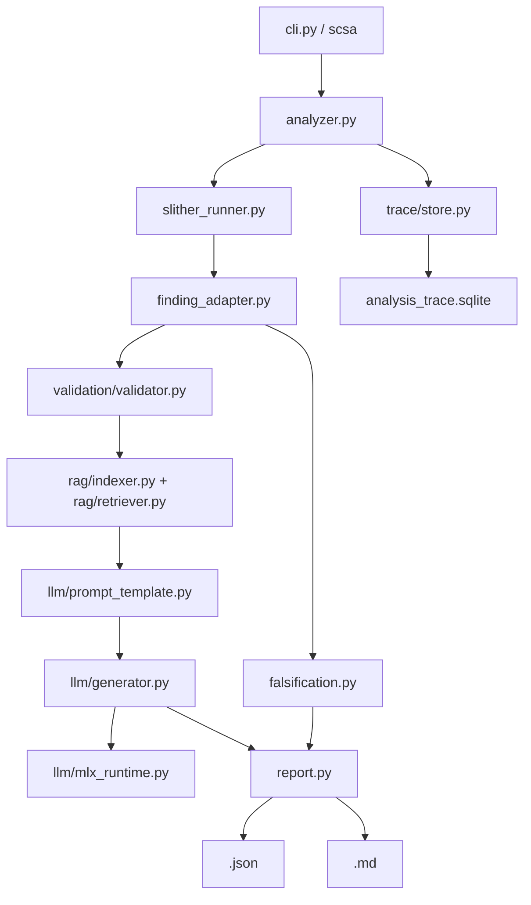

# 001 — 專案架構書

## Status

current；架構描述已核對 `src/smart_contract_audit/`、`schema/report.schema.json`、`eval/`、`.github/workflows/ci.yml`、2026-06-01 安全預設收斂與 2026-07-08 falsification pack report contract。

## Summary

決策：本專案採用本地優先的 CLI-first pipeline，讓 Slither 產生漏洞事實，RAG 與 MLX 只負責補上下文與生成可讀說明。資料輸出固定為 JSON、Markdown 與 SQLite trace，並為每個 finding 產生 reviewer-facing falsification pack，確保 finding 可回放、可確認，也可被反證推翻。

## Requirements

功能需求：

1. 接收單一入口 Solidity `.sol` 檔。
2. 執行 Slither 靜態分析並標準化 findings。
3. 透過 JSON schema 驗證報告結構。
4. 從本地 RAG chunks 檢索相關修復語境。
5. 為 finding 產生 counterevidence checks、confirmation requirements 與 missing evidence。
6. 產生 JSON、Markdown 與 SQLite trace。
7. 支援 deterministic fallback 與可選 MLX 本地模型。

非功能需求：

| 項目 | 目前門檻 |
|---|---|
| 單次分析時間 | `tests/test_e2e.py` 要求 `total_duration_ms < 120,000` |
| 輸入大小 | 入口檔最多 500 行 |
| 資源上限 | 2026-04-30 E2E 最大 RSS `54,231,040 bytes` |
| 可追溯性 | 每個 mapped finding 寫入 `trace_findings` |
| CI | ruff、pytest、RAG eval、judge eval |

## Component Diagram

## Data Flow

1. `scsa analyze` 解析 CLI 參數，把 `contract_path`、`output_dir`、`trace_db`、`dataset_chunks`、`rag_mode`、`model_path` 傳給 `analyze_contract`。
2. `analyze_contract` 讀取 Solidity 原始碼，產生 `contract_id`，建立 `analysis_trace_id`。
3. `_validate_input` 檢查 `.sol` 副檔名與 500 行上限。
4. `run_slither` 執行 Slither，回傳 raw JSON、solc version、Slither version 與 warnings。
5. `normalize_slither_json` 把 detector 映射到 `Finding`；未映射 detector 以 `unmapped_###` 寫入 trace。
6. `build_falsification_pack` 依 finding 類型與既有 evidence 產生 reviewer counterevidence checks。
7. `retrieve_chunks` 依 `rag_mode` 回傳 RAG chunks，`generate_finding_details` 產生 explanation、attack path、fix suggestion。
8. `TraceStore.record_finding` 寫入 raw detector、normalized finding、chunk ids、prompt、LLM output。
9. `write_json_report` 與 `write_markdown_report` 寫入報告。

## Module Boundaries

| 模組 | 責任 | 不負責 |
|---|---|---|
| `cli.py` | 參數解析與命令分派 | 安全判斷 |
| `slither_runner.py` | solc/Slither 呼叫與 raw JSON 取得 | finding schema 設計 |
| `finding_adapter.py` | detector 到內部 vulnerability type 映射 | 執行 Slither |
| `falsification.py` | reviewer 反證檢查、確認需求與缺失證據 | 證明漏洞存在或不存在 |
| `validation/` | JSON schema 驗證 | 修改報告內容 |
| `rag/` | chunk 載入、BM25/dense 檢索、rerank | 判定漏洞是否存在 |
| `llm/` | prompt 包裝、MLX 或 fallback 生成 | 新增 Slither 沒有的 finding |
| `trace/` | SQLite trace 寫入與查詢 | 報告排版 |
| `report.py` | JSON/Markdown 報告輸出 | trace 儲存 |

## Storage

| 儲存 | 路徑 | 用途 |
|---|---|---|
| JSON report | `<out-dir>/<contract_id>.json` | 機器可讀報告 |
| Markdown report | `<out-dir>/<contract_id>.md` | 人類可讀報告 |
| SQLite trace | `<out-dir>/analysis_trace.sqlite` | finding 回放與除錯 |
| RAG chunks | `data/dataset_v1.0/chunks/chunks.jsonl` | 本地檢索語料 |
| MLX probe | `reports-mlx/mlx_probe.json` | 本地模型載入與資源證據 |

## Boundaries

本架構不覆蓋外部高階 judge API、正式審計簽核流程與合約經濟模型判定。Falsification pack 只列出 reviewer 應收集的反證與確認條件，不把 finding 升級為 confirmed exploit，也不證明漏洞不存在。2026-05-04 已完成 10 個公開專案 `10/10` analyzer 與 `10/10` native build 驗證；任何把 LLM 改成漏洞事實來源的變更，都必須先更新本文件與 schema 驗證策略。

## Assumptions

- 使用者在本機執行，輸入為單一 Solidity 入口檔。
- Slither 與 solc 可在本機環境執行；2026-04-30 驗證版本為 Slither `0.11.5`、solc `0.8.34`。
- RAG fixture 規模小，`eval/run_eval.py` 的 4 個案例可作為回歸門檻。
- 本機 MLX 模型可選；沒有模型時 deterministic fallback 是合法降級路徑。

## Trade-offs

| 決策 | 替代方案 | 取捨 |
|---|---|---|
| CLI-first | 先做 Web UI | CLI 能直接接 CI 與 pytest，Web UI 留作展示層 |
| Slither 作事實來源 | LLM 直接判斷漏洞 | Slither 可重現且可 trace，LLM 只補說明 |
| SQLite trace | 只輸出 JSON | SQLite 可查 per-finding 原始證據，成本是多一個輸出檔 |
| deterministic fallback | 強制 MLX | 無模型也能跑完整流程，成本是生成品質低於真模型 |

## Revisit Items

| 條件 | 需要重看 |
|---|---|
| 入口檔超過 500 行成為常態 | 輸入模型與分段策略 |
| 專案支援 Foundry/Hardhat | import resolution、native build preflight、dependency preparation、Hardhat artifacts/cache path 與 10 repo public build 驗證 |
| 外部 judge API 接入 | API key 管理、成本、速率限制與資料外傳政策 |
| `.git` baseline 建立 | review workflow 與 CI/PR 交付流程 |

## References

- `src/smart_contract_audit/analyzer.py`
- `src/smart_contract_audit/cli.py`
- `schema/report.schema.json`
- `.github/workflows/ci.yml`
- `docs/guides/001-usage-manual.md`
- `docs/reference/001-validation-procedure-log.md`
