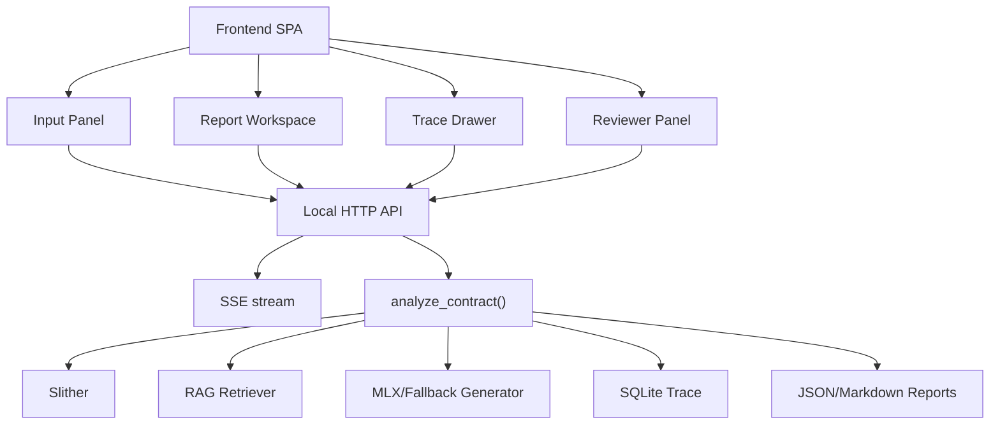

# 002 — 前端架構書

## Status

draft；2026-05-04 已實作 React/Vite 工作台與 `src/smart_contract_audit/http_api.py` 本機 HTTP API，Gradio 入口仍保留為可選 demo。

## Summary

決策：前端定位為「審計 triage 工作台」，核心畫面必須讓使用者在同一頁看到漏洞原始碼、AI 自然語言解釋、攻擊路徑、可套用修復碼、judge 分數、token 用量與 trace 證據。正式前端採用獨立 SPA 加本地 HTTP API，後端仍沿用 `analyze_contract()` 作唯一分析核心。

## Requirements

功能需求：

1. 上傳單一 `.sol` 或選擇本地 Solidity project directory。
2. 設定 `rag_mode`、`dataset_chunks`、`model_path`。
3. 顯示分析狀態：queued、running、finding、no_finding、partial_analysis、error。
4. 報告首屏顯示 `overall_status`、`review_status`、`trace_id`、`dataset_version`、`model_version`、`solc_version`、`slither_version`。
5. 每個 finding 顯示 vulnerable code、Explanation、Attack path、Fix suggestion、AI remediation code、local/external 報告品質 judge score、prompt/completion/total tokens。
6. 支援 trace detail 查詢：raw Slither、normalized finding、RAG chunk ids、packed prompt、LLM raw output。
7. 支援 reviewer status 編輯：pending_human_review、approved、rejected、blocked。

非功能需求：

| 項目 | 目標值 |
|---|---|
| 單次分析超時 | 120,000 ms，沿用 `tests/test_e2e.py` 門檻 |
| 分析併發 | 本機 MVP 固定 1 個 active analysis |
| 狀態輪詢 | 每 1,000 ms 查詢一次 running job |
| UI 互動延遲 | p95 小於 100 ms，不含分析執行 |
| 報告渲染 | 100 個 findings 內 p95 小於 500 ms |
| 輸入上限 | 單檔 500 行；專案 100 個 Solidity 檔、5,000 行 |

## Component Diagram



## Frontend Layout

主畫面採三欄工作台：

| 區域 | 寬度 | 內容 |
|---|---:|---|
| 左欄 | 280 px | 輸入、RAG mode、模型設定、歷史 trace list |
| 中欄 | flex | findings list、vulnerable code、AI remediation code |
| 右欄 | 360 px | metadata、報告品質 judge score、token usage、review status、trace evidence |

報告 finding card 固定欄位順序：

1. 風險摘要：vulnerability_type、severity、detector、location。
2. 錯誤證據：vulnerable code snippet 與 Slither evidence。
3. AI 說明：explanation、attack path、fix suggestion。
4. 修復輸出：AI remediation code，支援 copy。
5. 品質指標：finding confidence、explanation confidence、local judge、external judge、prompt/completion/total tokens。

## API Contracts

已實作 HTTP API：

| Method | Path | 用途 |
|---|---|---|
| `POST` | `/api/analyses` | 建立分析 job |
| `GET` | `/api/analyses/{analysis_id}` | 查詢 job 狀態與 report summary |
| `GET` | `/api/analyses/{analysis_id}/stream` | SSE 推送 queued、running、finding complete、done/error |
| `GET` | `/api/reports/{contract_id}` | 讀 JSON report |
| `GET` | `/api/traces/{trace_id}` | 讀 trace detail，支援 `finding_id` query |
| `PATCH` | `/api/reports/{contract_id}/review` | 更新 reviewer status |

`POST /api/analyses` request：

```json
{
  "input_path": "tests/contracts/VulnerableVault.sol",
  "rag_mode": "fallback",
  "dataset_chunks": "data/dataset_v1.0/chunks/chunks.jsonl",
  "model_path": null
}
```

`GET /api/reports/{contract_id}` response 直接使用 `AnalysisReport.to_dict()`，必備欄位包含 `report_version`、`review_status`、`findings[].vulnerable_code`、`findings[].remediation_code`、`findings[].local_judge_score`、`findings[].external_judge_score`、`analysis_metadata.total_tokens`。

`PATCH /api/reports/{contract_id}/review` request：

```json
{
  "review_status": "approved"
}
```

`review_status` 允許值為 `pending_human_review`、`approved`、`rejected`、`blocked`。成功後會同步更新 JSON report、Markdown report 的 reviewer status 行與 SQLite `analysis_trace.review_status`。

## State Model

前端狀態分 4 層：

| State | 來源 | 更新規則 |
|---|---|---|
| `analysisJob` | `/api/analyses/{id}` 與 SSE | SSE 優先，連線失敗後每 1,000 ms poll |
| `report` | `/api/reports/{contract_id}` | job terminal status 後讀取 |
| `selectedFindingId` | URL query `finding` | 點擊 finding 或 trace row 時更新 |
| `reviewDraft` | local component state | PATCH 成功後同步 report.review_status |

URL 格式：

```text
/reports/{contract_id}?finding=f_001&trace=trace_5db8e49d0586
```

## Error Handling

| Failure | UI 行為 |
|---|---|
| Slither executable missing | 顯示 install hint：`uv sync --extra audit --dev` |
| Input validation failed | 在 input panel 顯示 `.sol`、500 行、100 檔、5,000 行限制 |
| Analysis timeout | report status 顯示 `partial_analysis`，partial findings 標記 `partial=true` |
| Trace read failed | report 仍可讀，trace drawer 顯示 unavailable |
| External judge unavailable | external score 顯示 `0.00/5` 或 adapter error，local score 保留 |

## Boundaries

本前端不負責新增漏洞事實、不繞過 Slither、不替代最終審計簽核、不直接修改 Solidity 原始碼、不自動套用 AI remediation code、不上傳私有合約到第三方服務。任何資料外傳、外部 judge API、雲端儲存或多人協作功能，都必須另寫資料治理與權限設計。

## Assumptions

- 部署形態為本機單使用者，分析併發固定 1。
- 後端 Python package 保持 `analyze_contract()` 作唯一分析入口。
- 報告 schema 至少包含 2026-05-01 已驗證欄位：vulnerable code、remediation code、報告品質 judge score、token usage。
- 初版不處理大型 monorepo；專案輸入上限為 100 個 Solidity 檔與 5,000 行。

## Trade-offs

| 決策 | 替代方案 | 取捨 |
|---|---|---|
| 獨立 SPA + 本地 API | 延續 Gradio | SPA 能做 code viewer、trace drawer、review workflow；成本是新增 API 層 |
| SSE + polling fallback | WebSocket | SSE 對單向 job 狀態足夠且可由瀏覽器原生支援；polling 保留為斷線 fallback |
| 報告 JSON 作前端資料源 | 直接查 SQLite 組 UI | JSON schema 穩定、容易測試；深層 trace 仍需 SQLite endpoint |
| AI remediation code 只展示 | 自動 patch 原始碼 | 展示符合 triage 定位；自動 patch 需額外安全確認與 diff review |

## Revisit Items

| 條件 | 需要重看 |
|---|---|
| 同時分析超過 1 個 job | 加 job queue、cancel、resource lock |
| 報告超過 100 個 findings | 加 virtualized list 與 lazy trace fetch |
| 接入外部 judge API | 加 API key storage、資料外傳確認、成本與 rate limit |
| 需要多人審核 | 加 auth、role、audit log、review assignment |

## References

- `src/smart_contract_audit/web.py`
- `src/smart_contract_audit/analyzer.py`
- `src/smart_contract_audit/report.py`
- `src/smart_contract_audit/trace/lookup.py`
- `src/smart_contract_audit/validation/schema.py`
- `docs/design/001-project-architecture.md`
- `docs/guides/001-usage-manual.md`
