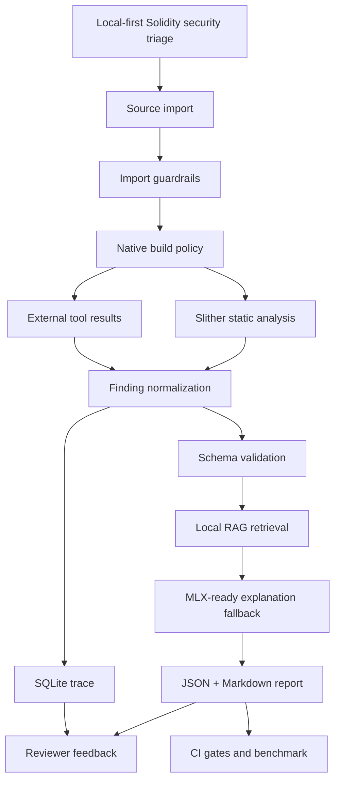

# Smart Contract Security Assistant Knowledge Graph

更新日期：2026-05-31。

本文件把專案能力、證據、輸出 artifact 與驗證命令整理成 knowledge graph，方便 reviewer 快速理解系統邊界與可信證據。

術語——具體含義：
- Knowledge graph：用節點描述能力、資料、證據與 artifact，用邊描述資料流、驗證關係與輸出關係。
- Evidence：可由命令或檔案驗證的證據，例如 pytest 結果、benchmark 分數、SQLite trace、schema 與 GitHub Actions workflow。
- Trust policy：分析外部 source 時套用的安全邊界，例如 imported source 一律 untrusted，預設停用 native build scripts。

## Product Capability Graph



## Core Nodes

| Node | Type | Evidence |
|---|---|---|
| CLI entrypoint | Capability | `src/smart_contract_audit/cli.py` |
| HTTP API | Capability | `src/smart_contract_audit/http_api.py` |
| Source import guardrails | Capability | `src/smart_contract_audit/source_import.py` |
| Slither integration | Capability | `src/smart_contract_audit/slither_runner.py` |
| External tool registry | Capability | `src/smart_contract_audit/external_tools.py` |
| Finding normalization | Capability | `src/smart_contract_audit/finding_adapter.py`, `src/smart_contract_audit/external_finding_adapter.py` |
| RAG retrieval | Capability | `src/smart_contract_audit/rag/retriever.py`, `eval/run_eval.py` |
| MLX-ready generation | Capability | `src/smart_contract_audit/llm/mlx_runtime.py` |
| Report builder | Capability | `src/smart_contract_audit/report_builder.py`, `src/smart_contract_audit/report.py` |
| SQLite trace | Evidence store | `src/smart_contract_audit/trace/store.py` |
| Frontend workbench | Review surface | `frontend/src/App.tsx`, `frontend/src/components/` |
| CI validation | Evidence gate | `.github/workflows/ci.yml` |

## Evidence Edges

| Edge | Meaning | Validation |
|---|---|---|
| Source import -> trust policy | Remote input is staged as untrusted source | `uv run pytest tests/test_source_import.py tests/test_http_api.py` |
| Slither -> normalized finding | Detector output becomes stable report finding | `uv run pytest tests/test_slither.py tests/test_adapter.py` |
| External tools -> normalized finding | Mythril/Echidna/Aderyn/Medusa/Halmos output becomes report finding | `uv run pytest tests/test_external_tools.py tests/test_external_finding_adapter.py` |
| Normalized finding -> schema | Report payload obeys JSON contract | `uv run pytest tests/test_validation_and_mlx.py` |
| RAG -> generation | Retrieved evidence feeds deterministic or MLX-ready explanation | `uv run python eval/run_eval.py` |
| Report -> trace | Finding, prompt and review state stay auditable | `uv run pytest tests/test_report_builder.py tests/test_e2e.py` |
| Report -> CI | Benchmark and comparison gates can fail regressions | `uv run python eval/run_public_benchmark.py --min-supported-hit-rate 0.95 --min-score-gap 30 --min-recall 0.5 --min-f1 0.5` |

## Local Artifact Rebuild

```bash
uv run python scripts/build_knowledge_graph.py
```

The command writes local artifacts to `knowledge-graph-out/`:

- `graph.json`
- `GRAPH_REPORT.md`
- `graph.html`

`knowledge-graph-out/` is intentionally ignored by Git. The generated files are review artifacts, not source files.

## Public Repository Rule

Public GitHub should keep product docs, source code, tests, CI, fixtures and benchmark references. Local agent notes, one-off planning traces, generated reports and graph output should stay under ignored local paths such as `.local/`, `reports*/`, `knowledge-graph-out/` or `graphify-out/`.
