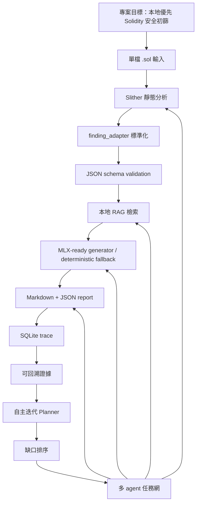
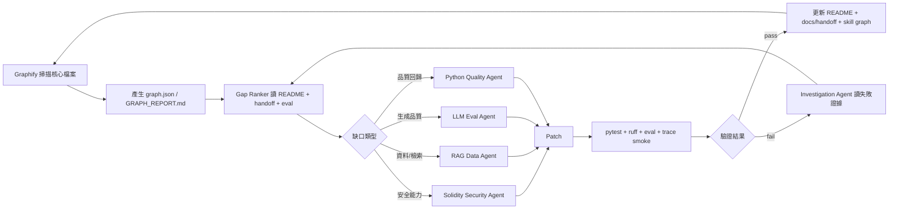

# 智能合約安全分析助理 Skill Graph

更新日期：2026-04-30。

來源模型：Skill Graph 將能力、證據、缺口、計畫與執行結果連成可更新圖；本文件把該模型改寫為專案自主迭代用的多 agent 架構。參考來源：https://skill-graph.com/

術語——具體含義：
- Skill Graph：以節點表示能力、工具、模組、驗證證據與缺口，以有向邊表示「產生、驗證、阻塞、觸發、回饋」關係。
- Agent：可獨立執行一類任務的工作單元，例如安全分析、RAG 資料維護、測試驗證、文件同步。
- Evidence：可被命令或檔案驗證的證據，例如 pytest 結果、eval 分數、SQLite trace、schema、README 記錄。
- Gap：阻止專案進入下一能力階段的缺口，例如多檔 Solidity、真實 MLX 模型驗證、CI eval 自動化。
- Iteration Loop：以「偵測缺口→產生任務→修改→驗證→更新圖譜」為一次閉環。

## 範圍

本圖譜覆蓋 48 個核心專案檔案，排除簡報輸出、node_modules 與快取；本機可用 skill 來源含 94 個 SKILL.md，去重後 90 個 skill 名稱。

## 核心能力圖



## Skill 到 Agent 映射

| Agent | 使用 skill | 操作邊界 | 輸出證據 |
|---|---|---|---|
| Orchestrator | arch-design, design, autoplan, dev | 將缺口拆成可執行任務，分派 agent，合併結果 | docs/skill-graph.md、docs/handoff.md |
| Solidity Security Agent | solidity-security, cso, investigate | 擴充 detector mapping、審查漏洞分類、分析 Slither raw output | tests/test_slither.py、tests/test_public_project_builds.py |
| RAG Data Agent | rag-implementation, embedding-strategies, hybrid-search-implementation, graphify | 維護 chunks、索引、召回測試與圖譜更新 | data/dataset_v1.0/chunks/chunks.jsonl、eval/run_eval.py |
| LLM Eval Agent | llm-evaluation, prompt-engineering-patterns, ml-pipeline-workflow | 驗證 prompt、judge 規則、本地模型 fallback | eval/run_judge.py、tests/test_validation_and_mlx.py |
| Python Quality Agent | python-testing-patterns, python-error-handling, python-resource-management, python-resilience, uv-package-manager | 維護 pytest、ruff、錯誤處理、資源釋放 | uv run pytest、uv run ruff check . |
| Product Doc Agent | write-docs, document-release | 同步 README、handoff、使用說明與驗證日誌 | README.md、docs/handoff.md、docs/reference/001-validation-procedure-log.md |
| QA Agent | qa, e2e, benchmark, health | 跑端到端、記憶體、UI 與回歸驗證 | tests/test_e2e.py、/usr/bin/time -l output |
| Release Agent | review, handoff, ship, github-actions-templates | 在有 git 邊界時做 diff review、CI、PR、交付 | .github/workflows/ci.yml、review report |

## 自主更新迭代圖



## 節點與邊規則

| 節點類型 | 範例 | 必要字段 |
|---|---|---|
| Capability | Slither integration、RAG retrieval、MLX runtime | id、owner_agent、evidence_files、validation_command |
| Skill | solidity-security、rag-implementation、llm-evaluation | id、source_path、agent_role、trigger |
| Evidence | 15 passed、recall_at_k=1.0、average_judge_score=5.0 | command、date、artifact_path、result |
| Gap | multi-file Solidity、real MLX 8B load test、CI eval | severity、blocked_capability、acceptance_test |
| Task | add detector、refresh chunks、tighten schema | input_gap、write_scope、validation_command |

| 邊類型 | 含義 | 標準結構 | 異常結構 |
|---|---|---|---|
| PRODUCES | A 產生 B | Agent -> Patch -> Evidence | Patch 沒有 validation_command |
| VALIDATES | A 驗證 B | Command -> Evidence -> Capability | Evidence 無日期或 artifact_path |
| BLOCKS | Gap 阻塞 Capability | Gap -> Capability -> Task | Gap 無 acceptance_test |
| TRIGGERS | Evidence 觸發 Task | Failed command -> Investigation -> Task | 失敗日誌未保留 |
| UPDATES | Task 更新 Graph | Passed validation -> docs update -> graph rebuild | 改程式未更新 README/handoff |

## 優先缺口

| 優先級 | Gap | 驗收命令 |
|---|---|---|
| P0 done | CI 已自動跑 eval/run_eval.py 與 eval/run_judge.py | GitHub Actions 已新增兩個 eval step，本地命令需通過 |
| P1 done | 同目錄 Solidity import resolution 已納入 | 新增多檔 fixture，uv run pytest tests/test_slither.py 通過 |
| P1 done | 本機 MLX 4bit 模型已完成 `mlx-lm` 載入 probe | `uv run scsa mlx-probe --auto-discover-model --max-tokens 4 --output reports-mlx/mlx_probe.json` 記錄 `load_succeeded=true`、峰值 RSS 661,520,384 bytes |
| P2 done | Graph artifact 可由本機命令重建 | `uv run python scripts/build_skill_graph.py` 產生本機 `graphify-out/`，該目錄不追蹤到 GitHub |

## 最小執行協議

1. 每次自主迭代先讀 `docs/skill-graph.md`、`docs/handoff.md`、`README.md`、`pyproject.toml`。
2. 每個 agent 只能修改自己的 write_scope；跨邊界改動由 Orchestrator 合併。
3. 完成後至少跑 `uv run pytest`、`uv run ruff check .`；碰到 RAG/LLM/Slither 改動時追加對應 eval 或 focused test。

## Graph Artifact 命令

```bash
uv run python scripts/build_skill_graph.py
```

該命令使用標準庫產生本機 `graphify-out/`，避免 node_modules 與快取污染圖譜；若要改用外部 `graphify` CLI，安裝前需先確認。
