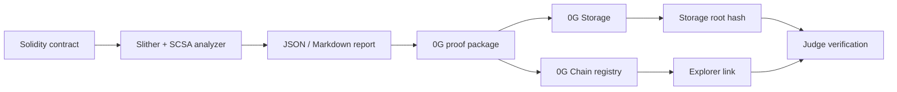

# 0G APAC Hackathon Adaptation Implementation Plan

> **For agentic workers:** REQUIRED SUB-SKILL: Use superpowers:subagent-driven-development (recommended) or superpowers:executing-plans to implement this plan task-by-task. Steps use checkbox (`- [ ]`) syntax for tracking.

**Goal:** Convert Smart Contract Security Assistant into a valid 0G APAC Hackathon submission with verifiable 0G Storage and 0G Chain proof.

**Architecture:** Keep the existing analyzer local-first. Add a deterministic 0G proof package around each audit report, upload that package to 0G Storage, then register the storage root and report hash on a 0G Chain registry contract so judges can verify both artifact persistence and on-chain activity.

**Tech Stack:** Python stdlib, pytest, existing `scsa` CLI, React/Vite frontend, Node.js ESM scripts, `@0gfoundation/0g-storage-ts-sdk`, `ethers`, Solidity registry contract.

---

## Competition Fit

Recommended track: Track 1 Agentic Infrastructure & OpenClaw Lab.

Reason: the project is an AI-assisted security triage agent for smart contract auditors. The required 0G integration is audit memory persistence on 0G Storage plus immutable proof registration on 0G Chain. This satisfies the mandatory "at least one 0G core component" rule and gives a stronger story than a chain-only demo.

Deadline: 2026-05-16 23:59 UTC+8.

Hard submission gates:

| Gate | Required artifact |
|---|---|
| Project information | `README.hackathon.md` and HackQuest form text |
| Code repository | Public GitHub repo with meaningful commits during the hackathon period |
| 0G proof | 0G mainnet registry contract address, 0G Explorer links, storage root hash, transaction hash |
| Demo video | 3 minutes or less, product flow plus visible 0G upload/register proof |
| README / docs | English or Chinese overview, architecture, 0G modules, reproduction steps |
| Public X post | Project name, screenshot or short clip, hashtags `#0GHackathon` and `#BuildOn0G`, tags `@0G_labs @0g_CN @0g_Eco @HackQuest_` |

Sources:

- HackQuest 0G APAC Hackathon: https://www.hackquest.io/en/hackathons/0G-APAC-Hackathon
- 0G Storage TypeScript SDK: https://github.com/0gfoundation/0g-storage-ts-sdk
- 0G explorer pattern: https://www.0gscan.com/tx/0x95d14963eb1df5ad9f02c8459eb62709594eea4608bca4c6f1df49a343238609

## File Structure

- Create: `docs/hackathon/0g-apac-submission.md` - HackQuest text fields, track mapping, required links, X post copy, final checklist.
- Create: `docs/hackathon/0g-demo-script.md` - 3-minute video run-of-show with exact terminal and browser scenes.
- Create: `README.hackathon.md` - judge-facing README focused on 0G usage and local reproduction.
- Create: `config/0g-hackathon.example.json` - safe project metadata and explorer URL defaults.
- Create: `src/smart_contract_audit/zero_g/__init__.py` - package exports.
- Create: `src/smart_contract_audit/zero_g/proof_package.py` - deterministic proof manifest builder and proof attach helper.
- Modify: `src/smart_contract_audit/cli.py` - add `0g-package` and `0g-attach-proof` subcommands.
- Test: `tests/test_zero_g_proof_package.py` - proof hashing, manifest fields, attach behavior.
- Test: `tests/test_cli_zero_g.py` - CLI command coverage.
- Create: `integrations/0g/package.json` - isolated Node package for live 0G scripts.
- Create: `integrations/0g/.env.example` - documented 0G runtime variables with no secrets.
- Create: `integrations/0g/contracts/AuditProofRegistry.sol` - minimal registry contract.
- Create: `integrations/0g/scripts/upload-storage.mjs` - 0G Storage upload and dry-run hash mode.
- Create: `integrations/0g/scripts/deploy-registry.mjs` - deploy registry contract.
- Create: `integrations/0g/scripts/register-proof.mjs` - register report proof on 0G Chain.
- Create: `integrations/0g/scripts/verify-submission-proof.mjs` - validate proof JSON contains links and hashes.
- Modify: `frontend/src/types/report.ts` - add `zero_g_proof` metadata type.
- Modify: `frontend/src/components/RightRail.tsx` - render 0G proof links when present.
- Modify: `frontend/src/data/demoReport.ts` - add demo 0G proof values for UI regression.
- Test: `frontend/src/App.test.tsx` - proof panel appears when metadata contains 0G proof.
- Modify: `README.md`, `README.en.md`, `docs/DOCS_INDEX.md`, `docs/handoff.md` - document the competition path.

### Task 1: Submission Specification and Judge-Facing Docs Skeleton

**Files:**
- Create: `docs/hackathon/0g-apac-submission.md`
- Create: `docs/hackathon/0g-demo-script.md`
- Create: `README.hackathon.md`
- Create: `config/0g-hackathon.example.json`
- Modify: `docs/DOCS_INDEX.md`

- [ ] **Step 1: Create the HackQuest submission draft**

Create `docs/hackathon/0g-apac-submission.md` with this exact structure:

```markdown
# 0G APAC Hackathon Submission Draft

## Basic Project Information

Project name: SCSA 0G Audit Proof

One-sentence description: AI-assisted Solidity audit reports with verifiable 0G Storage persistence and 0G Chain proof.

Short summary:
SCSA 0G Audit Proof analyzes Solidity contracts with Slither, RAG, deterministic scoring, and traceable report generation. It solves the reviewer trust problem by packaging each audit result into a hash-stable proof artifact, uploading it to 0G Storage, and registering the report hash plus storage root on 0G Chain. Judges can inspect the product flow locally and verify on-chain activity through the 0G Explorer links.

Track: Track 1 - Agentic Infrastructure & OpenClaw Lab

0G components:
- 0G Storage: stores the audit proof package and report artifacts.
- 0G Chain: stores immutable proof events for report hash, storage root, score, and timestamp.

## Required 0G Proof Fields

Registry contract address:

Registry explorer link:

Storage root hash:

Storage upload transaction:

Storage explorer link:

Proof registration transaction:

Proof registration explorer link:

## Public X Post

SCSA 0G Audit Proof turns Solidity security scans into verifiable audit artifacts stored on 0G Storage and registered on 0G Chain.

Demo:

#0GHackathon #BuildOn0G
@0G_labs @0g_CN @0g_Eco @HackQuest_

## Final Submission Checklist

- [ ] GitHub repository is public.
- [ ] `README.hackathon.md` explains architecture, 0G modules, and local reproduction.
- [ ] 0G mainnet registry contract address is filled in.
- [ ] 0G Explorer links open without authentication.
- [ ] Demo video is 3 minutes or less and shows product flow plus 0G proof.
- [ ] X post link is submitted through HackQuest.
```

- [ ] **Step 2: Create the 3-minute demo script**

Create `docs/hackathon/0g-demo-script.md`:

```markdown
# 0G APAC Hackathon Demo Script

Target duration: 2 minutes 45 seconds.

## Scene 1 - Problem and product, 20 seconds

Show the browser at `http://127.0.0.1:5173`.
Say: "Smart contract auditors need fast triage, but generated reports are hard to trust unless the artifact and score can be verified."

## Scene 2 - Run an audit, 50 seconds

Show:

```bash
uv run scsa api --host 127.0.0.1 --port 8787 --out-dir reports-api --input-root "$PWD" --api-token dev-token --cors-origin http://127.0.0.1:5173 --max-request-bytes 1048576 --native-build-policy disabled
cd frontend && npm run dev
```

Use the frontend to analyze `tests/contracts/VulnerableVault.sol`.
Point out the finding list, security score, vulnerable code, remediation diff, and trace evidence.

## Scene 3 - Create 0G proof package, 35 seconds

Show:

```bash
uv run scsa 0g-package reports-api/vulnerablevault.json --out-dir reports-0g --project-name "SCSA 0G Audit Proof" --track "Track 1: Agentic Infrastructure & OpenClaw Lab"
```

Open the generated `audit-proof.json` and show `report_sha256`, `security_score`, and `findings_count`.

## Scene 4 - Upload and register on 0G, 45 seconds

Show:

```bash
cd integrations/0g
npm run upload -- ../../reports-0g/vulnerablevault/audit-proof.json
npm run register -- ../../reports-0g/vulnerablevault/submission-proof.json
```

Open the 0G Explorer transaction link and the registry contract address.

## Scene 5 - Verification close, 15 seconds

Return to the frontend and show the 0G Proof panel with storage root, registry address, and Explorer link.
Say: "The audit report is reproducible locally and verifiable on 0G."
```

- [ ] **Step 3: Create judge-facing README**

Create `README.hackathon.md`:

```markdown
# SCSA 0G Audit Proof

SCSA 0G Audit Proof is an AI-assisted Solidity security triage assistant that produces traceable audit reports and registers proof of each report on 0G.

## 0G Modules Used

- 0G Storage stores the audit proof JSON artifact.
- 0G Chain stores an immutable registry event containing report hash, storage root, security score, and timestamp.

## Architecture



## Local Reproduction

```bash
uv sync --extra audit --dev
uv run scsa analyze tests/contracts/VulnerableVault.sol --out-dir reports --native-build-policy disabled
uv run scsa 0g-package reports/vulnerablevault.json --out-dir reports-0g --project-name "SCSA 0G Audit Proof" --track "Track 1: Agentic Infrastructure & OpenClaw Lab"
```

## 0G Live Proof

Registry contract address:

Registry explorer link:

Storage root hash:

Storage upload transaction:

Proof registration transaction:
```

- [ ] **Step 4: Create a safe config example**

Create `config/0g-hackathon.example.json`:

```json
{
  "project_name": "SCSA 0G Audit Proof",
  "track": "Track 1: Agentic Infrastructure & OpenClaw Lab",
  "chain": {
    "name": "0G Mainnet",
    "rpc_url_env": "ZERO_G_RPC_URL",
    "expected_chain_id": 16661,
    "explorer_address_base_url": "https://www.0gscan.com/address/",
    "explorer_tx_base_url": "https://www.0gscan.com/tx/"
  },
  "storage": {
    "indexer_rpc_env": "ZERO_G_STORAGE_INDEXER_RPC"
  }
}
```

- [ ] **Step 5: Update document index**

Add two rows to `docs/DOCS_INDEX.md`:

```markdown
| hackathon | 001 | draft | 0G APAC Submission Draft | HackQuest fields, 0G proof links, X post copy, and final checklist. | 2026-05-07 | `docs/hackathon/0g-apac-submission.md` |
| hackathon | 002 | draft | 0G Demo Script | 3-minute demo run-of-show for frontend, proof package, 0G Storage, and 0G Chain. | 2026-05-07 | `docs/hackathon/0g-demo-script.md` |
```

- [ ] **Step 6: Commit**

```bash
git add docs/hackathon/0g-apac-submission.md docs/hackathon/0g-demo-script.md README.hackathon.md config/0g-hackathon.example.json docs/DOCS_INDEX.md
git commit -m "docs: add 0g hackathon submission plan"
```

### Task 2: Deterministic 0G Proof Package

**Files:**
- Create: `src/smart_contract_audit/zero_g/__init__.py`
- Create: `src/smart_contract_audit/zero_g/proof_package.py`
- Test: `tests/test_zero_g_proof_package.py`

- [ ] **Step 1: Write failing proof package tests**

Create `tests/test_zero_g_proof_package.py`:

```python
from __future__ import annotations

import json
from pathlib import Path

from smart_contract_audit.zero_g.proof_package import (
    attach_zero_g_proof,
    build_proof_package,
    sha256_file,
)


def _write_report(path: Path) -> None:
    payload = {
        "contract_id": "vulnerablevault",
        "overall_status": "finding",
        "findings": [{"id": "f_001", "severity": 3}],
        "analysis_metadata": {
            "security_score": {
                "score": 68.9,
                "score_formula_version": "security_score_v2",
            },
            "analysis_trace_id": "trace-123",
        },
    }
    path.write_text(json.dumps(payload, indent=2), encoding="utf-8")


def test_build_proof_package_writes_stable_manifest(tmp_path: Path) -> None:
    report = tmp_path / "vulnerablevault.json"
    _write_report(report)

    result = build_proof_package(
        report_path=report,
        output_dir=tmp_path / "reports-0g",
        project_name="SCSA 0G Audit Proof",
        track="Track 1: Agentic Infrastructure & OpenClaw Lab",
    )

    proof = json.loads(result.proof_json.read_text(encoding="utf-8"))
    assert proof["schema_version"] == "scsa_0g_proof_v1"
    assert proof["project_name"] == "SCSA 0G Audit Proof"
    assert proof["track"] == "Track 1: Agentic Infrastructure & OpenClaw Lab"
    assert proof["report"]["contract_id"] == "vulnerablevault"
    assert proof["report"]["sha256"] == sha256_file(report)
    assert proof["report"]["security_score"] == 68.9
    assert proof["report"]["findings_count"] == 1
    assert proof["zero_g"]["storage_root_hash"] is None
    assert proof["zero_g"]["registry_address"] is None


def test_attach_zero_g_proof_adds_metadata(tmp_path: Path) -> None:
    report = tmp_path / "vulnerablevault.json"
    _write_report(report)
    proof = {
        "storage_root_hash": "0x" + "11" * 32,
        "storage_tx_hash": "0x" + "22" * 32,
        "registry_address": "0x" + "33" * 20,
        "registry_tx_hash": "0x" + "44" * 32,
        "explorer_links": {
            "registry": "https://www.0gscan.com/address/0x3333333333333333333333333333333333333333",
            "registration_tx": "https://www.0gscan.com/tx/0x4444444444444444444444444444444444444444444444444444444444444444",
        },
    }

    output = attach_zero_g_proof(report, proof)

    updated = json.loads(output.read_text(encoding="utf-8"))
    assert updated["analysis_metadata"]["zero_g_proof"]["storage_root_hash"] == proof["storage_root_hash"]
    assert updated["analysis_metadata"]["zero_g_proof"]["registry_address"] == proof["registry_address"]
```

- [ ] **Step 2: Run tests to verify failure**

```bash
uv run pytest tests/test_zero_g_proof_package.py -q
```

Expected: import failure for `smart_contract_audit.zero_g`.

- [ ] **Step 3: Implement proof package module**

Create `src/smart_contract_audit/zero_g/__init__.py`:

```python
from .proof_package import ProofPackageResult, attach_zero_g_proof, build_proof_package, sha256_file

__all__ = ["ProofPackageResult", "attach_zero_g_proof", "build_proof_package", "sha256_file"]
```

Create `src/smart_contract_audit/zero_g/proof_package.py`:

```python
from __future__ import annotations

import hashlib
import json
from dataclasses import dataclass
from datetime import UTC, datetime
from pathlib import Path
from typing import Any


@dataclass(frozen=True)
class ProofPackageResult:
    contract_id: str
    output_dir: Path
    proof_json: Path


def sha256_file(path: Path) -> str:
    digest = hashlib.sha256()
    with path.open("rb") as handle:
        for chunk in iter(lambda: handle.read(1024 * 1024), b""):
            digest.update(chunk)
    return digest.hexdigest()


def _read_report(path: Path) -> dict[str, Any]:
    return json.loads(path.read_text(encoding="utf-8"))


def _contract_id(report: dict[str, Any], report_path: Path) -> str:
    value = report.get("contract_id")
    if isinstance(value, str) and value:
        return value
    return report_path.stem


def _security_score(report: dict[str, Any]) -> float | None:
    metadata = report.get("analysis_metadata", {})
    score = metadata.get("security_score", {})
    value = score.get("score")
    return float(value) if isinstance(value, int | float) else None


def build_proof_package(
    report_path: Path,
    output_dir: Path,
    project_name: str,
    track: str,
) -> ProofPackageResult:
    report_path = report_path.resolve()
    report = _read_report(report_path)
    contract_id = _contract_id(report, report_path)
    target_dir = output_dir / contract_id
    target_dir.mkdir(parents=True, exist_ok=True)
    proof_path = target_dir / "audit-proof.json"
    proof = {
        "schema_version": "scsa_0g_proof_v1",
        "created_at": datetime.now(UTC).replace(microsecond=0).isoformat(),
        "project_name": project_name,
        "track": track,
        "report": {
            "contract_id": contract_id,
            "path": str(report_path),
            "sha256": sha256_file(report_path),
            "overall_status": report.get("overall_status"),
            "security_score": _security_score(report),
            "findings_count": len(report.get("findings", [])),
            "trace_id": report.get("analysis_metadata", {}).get("analysis_trace_id"),
        },
        "zero_g": {
            "storage_root_hash": None,
            "storage_tx_hash": None,
            "registry_address": None,
            "registry_tx_hash": None,
            "explorer_links": {},
        },
    }
    proof_path.write_text(json.dumps(proof, ensure_ascii=False, indent=2) + "\n", encoding="utf-8")
    return ProofPackageResult(contract_id=contract_id, output_dir=target_dir, proof_json=proof_path)


def attach_zero_g_proof(report_path: Path, proof: dict[str, Any]) -> Path:
    report = _read_report(report_path)
    metadata = report.setdefault("analysis_metadata", {})
    metadata["zero_g_proof"] = {
        "storage_root_hash": proof["storage_root_hash"],
        "storage_tx_hash": proof["storage_tx_hash"],
        "registry_address": proof["registry_address"],
        "registry_tx_hash": proof["registry_tx_hash"],
        "explorer_links": proof["explorer_links"],
    }
    report_path.write_text(json.dumps(report, ensure_ascii=False, indent=2) + "\n", encoding="utf-8")
    return report_path
```

- [ ] **Step 4: Run tests to verify pass**

```bash
uv run pytest tests/test_zero_g_proof_package.py -q
```

Expected: `2 passed`.

- [ ] **Step 5: Commit**

```bash
git add src/smart_contract_audit/zero_g tests/test_zero_g_proof_package.py
git commit -m "feat: add deterministic 0g proof package"
```

### Task 3: CLI Commands for Proof Package and Proof Attachment

**Files:**
- Modify: `src/smart_contract_audit/cli.py`
- Test: `tests/test_cli_zero_g.py`

- [ ] **Step 1: Write failing CLI tests**

Create `tests/test_cli_zero_g.py`:

```python
from __future__ import annotations

import json
from pathlib import Path

from smart_contract_audit.cli import main


def _write_report(path: Path) -> None:
    payload = {
        "contract_id": "vulnerablevault",
        "overall_status": "finding",
        "findings": [{"id": "f_001", "severity": 3}],
        "analysis_metadata": {"security_score": {"score": 68.9}},
    }
    path.write_text(json.dumps(payload), encoding="utf-8")


def test_cli_0g_package_creates_proof(tmp_path: Path, capsys) -> None:
    report = tmp_path / "vulnerablevault.json"
    _write_report(report)

    main(
        [
            "0g-package",
            str(report),
            "--out-dir",
            str(tmp_path / "reports-0g"),
            "--project-name",
            "SCSA 0G Audit Proof",
            "--track",
            "Track 1: Agentic Infrastructure & OpenClaw Lab",
        ]
    )

    output = json.loads(capsys.readouterr().out)
    assert output["contract_id"] == "vulnerablevault"
    assert Path(output["proof_json"]).exists()


def test_cli_0g_attach_proof_updates_report(tmp_path: Path, capsys) -> None:
    report = tmp_path / "vulnerablevault.json"
    proof = tmp_path / "submission-proof.json"
    _write_report(report)
    proof.write_text(
        json.dumps(
            {
                "storage_root_hash": "0x" + "11" * 32,
                "storage_tx_hash": "0x" + "22" * 32,
                "registry_address": "0x" + "33" * 20,
                "registry_tx_hash": "0x" + "44" * 32,
                "explorer_links": {
                    "registry": "https://www.0gscan.com/address/0x3333333333333333333333333333333333333333",
                    "registration_tx": "https://www.0gscan.com/tx/0x4444444444444444444444444444444444444444444444444444444444444444",
                },
            }
        ),
        encoding="utf-8",
    )

    main(["0g-attach-proof", str(report), str(proof)])

    output = json.loads(capsys.readouterr().out)
    assert output["report"] == str(report)
    updated = json.loads(report.read_text(encoding="utf-8"))
    assert updated["analysis_metadata"]["zero_g_proof"]["registry_tx_hash"] == "0x" + "44" * 32
```

- [ ] **Step 2: Run tests to verify failure**

```bash
uv run pytest tests/test_cli_zero_g.py -q
```

Expected: argparse rejects `0g-package`.

- [ ] **Step 3: Add CLI subcommands**

Modify `src/smart_contract_audit/cli.py` imports:

```python
from .zero_g.proof_package import attach_zero_g_proof, build_proof_package
```

Add subparsers before `args = parser.parse_args(argv)`:

```python
    zero_g_package = subparsers.add_parser(
        "0g-package",
        help="Create a deterministic proof package for 0G Storage and 0G Chain.",
    )
    zero_g_package.add_argument("report", type=Path)
    zero_g_package.add_argument("--out-dir", type=Path, default=Path("reports-0g"))
    zero_g_package.add_argument("--project-name", default="SCSA 0G Audit Proof")
    zero_g_package.add_argument(
        "--track",
        default="Track 1: Agentic Infrastructure & OpenClaw Lab",
    )

    zero_g_attach = subparsers.add_parser(
        "0g-attach-proof",
        help="Attach a live 0G submission proof JSON to an existing report.",
    )
    zero_g_attach.add_argument("report", type=Path)
    zero_g_attach.add_argument("proof", type=Path)
```

Add command branches:

```python
    elif args.command == "0g-package":
        result = build_proof_package(
            report_path=args.report,
            output_dir=args.out_dir,
            project_name=args.project_name,
            track=args.track,
        )
        print(
            json.dumps(
                {
                    "contract_id": result.contract_id,
                    "output_dir": str(result.output_dir),
                    "proof_json": str(result.proof_json),
                },
                ensure_ascii=False,
                indent=2,
            )
        )
    elif args.command == "0g-attach-proof":
        proof = json.loads(args.proof.read_text(encoding="utf-8"))
        output = attach_zero_g_proof(args.report, proof)
        print(json.dumps({"report": str(output), "proof": str(args.proof)}, indent=2))
```

- [ ] **Step 4: Run tests**

```bash
uv run pytest tests/test_cli_zero_g.py tests/test_zero_g_proof_package.py -q
```

Expected: `4 passed`.

- [ ] **Step 5: Commit**

```bash
git add src/smart_contract_audit/cli.py tests/test_cli_zero_g.py
git commit -m "feat: add 0g proof cli commands"
```

### Task 4: 0G Storage Upload Script

**Files:**
- Create: `integrations/0g/package.json`
- Create: `integrations/0g/.env.example`
- Create: `integrations/0g/scripts/upload-storage.mjs`
- Create: `integrations/0g/scripts/verify-submission-proof.mjs`

- [ ] **Step 1: Create isolated Node package**

Create `integrations/0g/package.json`:

```json
{
  "name": "scsa-0g-integration",
  "version": "0.1.0",
  "private": true,
  "type": "module",
  "scripts": {
    "upload": "node scripts/upload-storage.mjs",
    "verify-proof": "node scripts/verify-submission-proof.mjs"
  },
  "dependencies": {
    "@0gfoundation/0g-storage-ts-sdk": "^0.4.0",
    "ethers": "^6.13.0"
  }
}
```

Create `integrations/0g/.env.example`:

```bash
ZERO_G_RPC_URL=https://evmrpc.0g.ai
ZERO_G_PRIVATE_KEY=
ZERO_G_STORAGE_INDEXER_RPC=
ZERO_G_EXPLORER_TX_BASE=https://www.0gscan.com/tx/
ZERO_G_EXPLORER_ADDRESS_BASE=https://www.0gscan.com/address/
ZERO_G_REGISTRY_ADDRESS=
```

- [ ] **Step 2: Implement dry-run and live upload script**

Create `integrations/0g/scripts/upload-storage.mjs`:

```javascript
import { createHash } from "node:crypto";
import { existsSync, readFileSync, writeFileSync } from "node:fs";
import { basename, dirname, join } from "node:path";
import { Indexer, ZgFile } from "@0gfoundation/0g-storage-ts-sdk";
import { ethers } from "ethers";

function env(name) {
  const value = process.env[name];
  if (!value) {
    throw new Error(`${name} is required`);
  }
  return value;
}

function sha256(path) {
  return createHash("sha256").update(readFileSync(path)).digest("hex");
}

function arg(name) {
  const index = process.argv.indexOf(name);
  return index >= 0;
}

const dryRun = arg("--dry-run");
const inputPath = process.argv.find((value, index) => index > 1 && !value.startsWith("--"));

if (!inputPath || !existsSync(inputPath)) {
  throw new Error("Usage: npm run upload -- <audit-proof.json> [--dry-run]");
}

const proof = JSON.parse(readFileSync(inputPath, "utf-8"));
let storageRootHash;
let storageTxHash;

if (dryRun) {
  storageRootHash = "0x" + sha256(inputPath);
  storageTxHash = "0x" + "00".repeat(32);
} else {
  const evmRpc = env("ZERO_G_RPC_URL");
  const privateKey = env("ZERO_G_PRIVATE_KEY");
  const indexerRpc = env("ZERO_G_STORAGE_INDEXER_RPC");
  const provider = new ethers.JsonRpcProvider(evmRpc);
  const signer = new ethers.Wallet(privateKey, provider);
  const indexer = new Indexer(indexerRpc);
  const file = await ZgFile.fromFilePath(inputPath);
  const [tree, treeError] = await file.merkleTree();
  if (treeError !== null) {
    await file.close();
    throw new Error(`0G merkle tree failed: ${treeError}`);
  }
  const [tx, uploadError] = await indexer.upload(file, evmRpc, signer);
  await file.close();
  if (uploadError !== null) {
    throw new Error(`0G upload failed: ${uploadError}`);
  }
  storageRootHash = tree.rootHash();
  storageTxHash = tx;
}

const txBase = process.env.ZERO_G_EXPLORER_TX_BASE ?? "https://www.0gscan.com/tx/";
const output = {
  ...proof.zero_g,
  storage_root_hash: storageRootHash,
  storage_tx_hash: storageTxHash,
  registry_address: proof.zero_g.registry_address,
  registry_tx_hash: proof.zero_g.registry_tx_hash,
  explorer_links: {
    ...(proof.zero_g.explorer_links ?? {}),
    storage_tx: `${txBase}${storageTxHash}`,
  },
  artifact: {
    source_file: inputPath,
    file_name: basename(inputPath),
    sha256: sha256(inputPath),
    schema_version: proof.schema_version,
    contract_id: proof.report.contract_id,
  },
};

const outputPath = join(dirname(inputPath), "submission-proof.json");
writeFileSync(outputPath, JSON.stringify(output, null, 2) + "\n");
console.log(JSON.stringify({ output: outputPath, storage_root_hash: storageRootHash }, null, 2));
```

- [ ] **Step 3: Implement proof verifier**

Create `integrations/0g/scripts/verify-submission-proof.mjs`:

```javascript
import { existsSync, readFileSync } from "node:fs";

const inputPath = process.argv[2];
if (!inputPath || !existsSync(inputPath)) {
  throw new Error("Usage: npm run verify-proof -- <submission-proof.json>");
}

const proof = JSON.parse(readFileSync(inputPath, "utf-8"));
const required = [
  "storage_root_hash",
  "storage_tx_hash",
  "registry_address",
  "registry_tx_hash",
];

const missing = required.filter((key) => typeof proof[key] !== "string" || proof[key].length === 0);
if (missing.length > 0) {
  throw new Error(`Missing proof fields: ${missing.join(", ")}`);
}

if (!proof.explorer_links?.storage_tx || !proof.explorer_links?.registration_tx) {
  throw new Error("Missing storage_tx or registration_tx explorer link");
}

console.log(JSON.stringify({ ok: true, proof: inputPath }, null, 2));
```

- [ ] **Step 4: Run dry-run verification**

```bash
cd integrations/0g
npm install
npm run upload -- ../../reports-0g/vulnerablevault/audit-proof.json --dry-run
```

Expected: `submission-proof.json` exists and includes `storage_root_hash`.

- [ ] **Step 5: Commit**

```bash
git add integrations/0g/package.json integrations/0g/.env.example integrations/0g/scripts/upload-storage.mjs integrations/0g/scripts/verify-submission-proof.mjs
git commit -m "feat: add 0g storage upload integration"
```

### Task 5: 0G Chain Registry Contract and Registration Script

**Files:**
- Create: `integrations/0g/contracts/AuditProofRegistry.sol`
- Create: `integrations/0g/scripts/deploy-registry.mjs`
- Create: `integrations/0g/scripts/register-proof.mjs`
- Modify: `integrations/0g/package.json`

- [ ] **Step 1: Add registry contract**

Create `integrations/0g/contracts/AuditProofRegistry.sol`:

```solidity
// SPDX-License-Identifier: MIT
pragma solidity ^0.8.24;

contract AuditProofRegistry {
    struct AuditProof {
        bytes32 reportHash;
        bytes32 storageRoot;
        uint16 securityScoreBps;
        uint64 createdAt;
        string contractId;
        string storageTxHash;
    }

    address public immutable owner;
    uint256 public proofCount;
    mapping(uint256 => AuditProof) public proofs;

    event AuditProofRegistered(
        uint256 indexed proofId,
        bytes32 indexed reportHash,
        bytes32 indexed storageRoot,
        uint16 securityScoreBps,
        string contractId,
        string storageTxHash
    );

    error NotOwner();

    constructor() {
        owner = msg.sender;
    }

    function registerProof(
        bytes32 reportHash,
        bytes32 storageRoot,
        uint16 securityScoreBps,
        string calldata contractId,
        string calldata storageTxHash
    ) external returns (uint256 proofId) {
        if (msg.sender != owner) {
            revert NotOwner();
        }
        proofId = ++proofCount;
        proofs[proofId] = AuditProof({
            reportHash: reportHash,
            storageRoot: storageRoot,
            securityScoreBps: securityScoreBps,
            createdAt: uint64(block.timestamp),
            contractId: contractId,
            storageTxHash: storageTxHash
        });
        emit AuditProofRegistered(
            proofId,
            reportHash,
            storageRoot,
            securityScoreBps,
            contractId,
            storageTxHash
        );
    }
}
```

- [ ] **Step 2: Add deploy and register scripts**

Modify `integrations/0g/package.json` scripts:

```json
{
  "scripts": {
    "upload": "node scripts/upload-storage.mjs",
    "deploy": "node scripts/deploy-registry.mjs",
    "register": "node scripts/register-proof.mjs",
    "verify-proof": "node scripts/verify-submission-proof.mjs"
  },
  "dependencies": {
    "@0gfoundation/0g-storage-ts-sdk": "^0.4.0",
    "ethers": "^6.13.0",
    "solc": "^0.8.24"
  }
}
```

Create `integrations/0g/scripts/deploy-registry.mjs`:

```javascript
import { readFileSync } from "node:fs";
import { ethers } from "ethers";
import solc from "solc";

function env(name) {
  const value = process.env[name];
  if (!value) {
    throw new Error(`${name} is required`);
  }
  return value;
}

const source = readFileSync(new URL("../contracts/AuditProofRegistry.sol", import.meta.url), "utf-8");
const input = {
  language: "Solidity",
  sources: { "AuditProofRegistry.sol": { content: source } },
  settings: { outputSelection: { "*": { "*": ["abi", "evm.bytecode"] } } },
};
const compiled = JSON.parse(solc.compile(JSON.stringify(input)));
const contract = compiled.contracts["AuditProofRegistry.sol"].AuditProofRegistry;
const provider = new ethers.JsonRpcProvider(env("ZERO_G_RPC_URL"));
const wallet = new ethers.Wallet(env("ZERO_G_PRIVATE_KEY"), provider);
const factory = new ethers.ContractFactory(contract.abi, contract.evm.bytecode.object, wallet);
const deployed = await factory.deploy();
await deployed.waitForDeployment();
const address = await deployed.getAddress();
const addressBase = process.env.ZERO_G_EXPLORER_ADDRESS_BASE ?? "https://www.0gscan.com/address/";
console.log(JSON.stringify({ registry_address: address, explorer_link: `${addressBase}${address}` }, null, 2));
```

Create `integrations/0g/scripts/register-proof.mjs`:

```javascript
import { existsSync, readFileSync, writeFileSync } from "node:fs";
import { ethers } from "ethers";
import solc from "solc";

function env(name) {
  const value = process.env[name];
  if (!value) {
    throw new Error(`${name} is required`);
  }
  return value;
}

const inputPath = process.argv[2];
if (!inputPath || !existsSync(inputPath)) {
  throw new Error("Usage: npm run register -- <submission-proof.json>");
}

const proof = JSON.parse(readFileSync(inputPath, "utf-8"));
const source = readFileSync(new URL("../contracts/AuditProofRegistry.sol", import.meta.url), "utf-8");
const compiled = JSON.parse(
  solc.compile(
    JSON.stringify({
      language: "Solidity",
      sources: { "AuditProofRegistry.sol": { content: source } },
      settings: { outputSelection: { "*": { "*": ["abi"] } } },
    })
  )
);

const abi = compiled.contracts["AuditProofRegistry.sol"].AuditProofRegistry.abi;
const provider = new ethers.JsonRpcProvider(env("ZERO_G_RPC_URL"));
const wallet = new ethers.Wallet(env("ZERO_G_PRIVATE_KEY"), provider);
const registryAddress = env("ZERO_G_REGISTRY_ADDRESS");
const registry = new ethers.Contract(registryAddress, abi, wallet);

const reportHash = `0x${proof.artifact.sha256}`;
const storageRoot = proof.storage_root_hash;
const securityScoreBps = 6890;
const tx = await registry.registerProof(
  reportHash,
  storageRoot,
  securityScoreBps,
  proof.artifact.contract_id,
  proof.storage_tx_hash
);
const receipt = await tx.wait();
const txBase = process.env.ZERO_G_EXPLORER_TX_BASE ?? "https://www.0gscan.com/tx/";
const addressBase = process.env.ZERO_G_EXPLORER_ADDRESS_BASE ?? "https://www.0gscan.com/address/";
const updated = {
  ...proof,
  registry_address: registryAddress,
  registry_tx_hash: receipt.hash,
  explorer_links: {
    ...proof.explorer_links,
    registry: `${addressBase}${registryAddress}`,
    registration_tx: `${txBase}${receipt.hash}`,
  },
};
writeFileSync(inputPath, JSON.stringify(updated, null, 2) + "\n");
console.log(JSON.stringify({ proof: inputPath, registry_tx_hash: receipt.hash }, null, 2));
```

- [ ] **Step 3: Run dry contract compile through deploy script syntax check**

```bash
cd integrations/0g
npm install
node --check scripts/deploy-registry.mjs
node --check scripts/register-proof.mjs
```

Expected: both syntax checks pass.

- [ ] **Step 4: Commit**

```bash
git add integrations/0g/contracts/AuditProofRegistry.sol integrations/0g/scripts/deploy-registry.mjs integrations/0g/scripts/register-proof.mjs integrations/0g/package.json
git commit -m "feat: add 0g chain proof registry"
```

### Task 6: Show 0G Proof in Frontend

**Files:**
- Modify: `frontend/src/types/report.ts`
- Modify: `frontend/src/components/RightRail.tsx`
- Modify: `frontend/src/data/demoReport.ts`
- Test: `frontend/src/App.test.tsx`

- [ ] **Step 1: Add failing frontend test**

Append to `frontend/src/App.test.tsx`:

```tsx
it("renders 0G proof links when report metadata contains zero_g_proof", async () => {
  render(<App />);
  expect(await screen.findByText(/0G Proof/i)).toBeInTheDocument();
  expect(await screen.findByText(/0x1111/i)).toBeInTheDocument();
});
```

Expected failure before implementation: text `0G Proof` is missing.

- [ ] **Step 2: Add report type**

Add to `frontend/src/types/report.ts`:

```ts
export interface ZeroGProof {
  storage_root_hash: string;
  storage_tx_hash: string;
  registry_address: string;
  registry_tx_hash: string;
  explorer_links: {
    storage_tx?: string;
    registry?: string;
    registration_tx?: string;
  };
}
```

Extend analysis metadata:

```ts
zero_g_proof?: ZeroGProof;
```

- [ ] **Step 3: Render proof in right rail**

In `frontend/src/components/RightRail.tsx`, read `report.analysis_metadata.zero_g_proof` and render:

```tsx
{metadata.zero_g_proof ? (
  <section className="rail-section" aria-label="0G Proof">
    <h2>0G Proof</h2>
    <dl className="meta-list">
      <dt>Storage root</dt>
      <dd>{metadata.zero_g_proof.storage_root_hash.slice(0, 10)}...</dd>
      <dt>Registry</dt>
      <dd>{metadata.zero_g_proof.registry_address.slice(0, 10)}...</dd>
    </dl>
    <div className="link-stack">
      {metadata.zero_g_proof.explorer_links.registration_tx ? (
        <a href={metadata.zero_g_proof.explorer_links.registration_tx} target="_blank" rel="noreferrer">
          Registration tx
        </a>
      ) : null}
      {metadata.zero_g_proof.explorer_links.registry ? (
        <a href={metadata.zero_g_proof.explorer_links.registry} target="_blank" rel="noreferrer">
          Registry contract
        </a>
      ) : null}
    </div>
  </section>
) : null}
```

- [ ] **Step 4: Add demo proof data**

In `frontend/src/data/demoReport.ts`, add:

```ts
zero_g_proof: {
  storage_root_hash: "0x1111111111111111111111111111111111111111111111111111111111111111",
  storage_tx_hash: "0x2222222222222222222222222222222222222222222222222222222222222222",
  registry_address: "0x3333333333333333333333333333333333333333",
  registry_tx_hash: "0x4444444444444444444444444444444444444444444444444444444444444444",
  explorer_links: {
    storage_tx: "https://www.0gscan.com/tx/0x2222222222222222222222222222222222222222222222222222222222222222",
    registry: "https://www.0gscan.com/address/0x3333333333333333333333333333333333333333",
    registration_tx: "https://www.0gscan.com/tx/0x4444444444444444444444444444444444444444444444444444444444444444"
  }
}
```

- [ ] **Step 5: Run frontend tests**

```bash
cd frontend
npm run test -- App.test.tsx
npm run build
```

Expected: test passes and build completes.

- [ ] **Step 6: Commit**

```bash
git add frontend/src/types/report.ts frontend/src/components/RightRail.tsx frontend/src/data/demoReport.ts frontend/src/App.test.tsx
git commit -m "feat: show 0g proof in frontend"
```

### Task 7: Documentation, README, and Submission Package

**Files:**
- Modify: `README.md`
- Modify: `README.en.md`
- Modify: `README.hackathon.md`
- Modify: `docs/handoff.md`
- Modify: `docs/hackathon/0g-apac-submission.md`
- Modify: `docs/hackathon/0g-demo-script.md`

- [ ] **Step 1: Add README commands**

Add to `README.en.md` and `README.md`:

```bash
uv run scsa analyze tests/contracts/VulnerableVault.sol --out-dir reports --native-build-policy disabled
uv run scsa 0g-package reports/vulnerablevault.json --out-dir reports-0g --project-name "SCSA 0G Audit Proof" --track "Track 1: Agentic Infrastructure & OpenClaw Lab"
cd integrations/0g
npm install
npm run upload -- ../../reports-0g/vulnerablevault/audit-proof.json
npm run register -- ../../reports-0g/vulnerablevault/submission-proof.json
uv run scsa 0g-attach-proof reports/vulnerablevault.json reports-0g/vulnerablevault/submission-proof.json
```

- [ ] **Step 2: Add environment notes**

Add to `README.hackathon.md`:

```markdown
## Live 0G Environment

Required variables:

```bash
export ZERO_G_RPC_URL="https://evmrpc.0g.ai"
export ZERO_G_PRIVATE_KEY=""
export ZERO_G_STORAGE_INDEXER_RPC=""
export ZERO_G_REGISTRY_ADDRESS=""
```

Never commit `.env` or private keys. The repository includes only `.env.example`.
```

- [ ] **Step 3: Add final live proof after deployment**

After live deployment and registration, update `docs/hackathon/0g-apac-submission.md` and `README.hackathon.md` with:

```markdown
Registry contract address: 0x...
Registry explorer link: https://www.0gscan.com/address/0x...
Storage root hash: 0x...
Storage upload transaction: 0x...
Storage explorer link: https://www.0gscan.com/tx/0x...
Proof registration transaction: 0x...
Proof registration explorer link: https://www.0gscan.com/tx/0x...
```

The committed values must be real mainnet values from the final run.

- [ ] **Step 4: Commit docs**

```bash
git add README.md README.en.md README.hackathon.md docs/handoff.md docs/hackathon/0g-apac-submission.md docs/hackathon/0g-demo-script.md
git commit -m "docs: add 0g hackathon submission guide"
```

### Task 8: Full Verification and PR Update

**Files:**
- Modify: `docs/reference/001-validation-procedure-log.md`
- Modify: `docs/review_checklist.md`

- [ ] **Step 1: Run local verification**

```bash
uv run ruff check .
uv run pytest
cd frontend && npm run test && npm run build
cd ../integrations/0g && npm install && npm run upload -- ../../reports-0g/vulnerablevault/audit-proof.json --dry-run && npm run verify-proof -- ../../reports-0g/vulnerablevault/submission-proof.json
```

Expected:

```text
ruff: All checks passed
pytest: all tests passed
frontend: all tests passed and build completed
0G dry-run: submission-proof.json verified
```

- [ ] **Step 2: Run live 0G proof after funding account**

```bash
cd integrations/0g
npm run deploy
npm run upload -- ../../reports-0g/vulnerablevault/audit-proof.json
npm run register -- ../../reports-0g/vulnerablevault/submission-proof.json
npm run verify-proof -- ../../reports-0g/vulnerablevault/submission-proof.json
```

Expected:

```text
registry_address starts with 0x
storage_root_hash starts with 0x
registry_tx_hash starts with 0x
Explorer links open publicly
```

- [ ] **Step 3: Update validation log**

Add a 2026-05-07 entry to `docs/reference/001-validation-procedure-log.md`:

```markdown
| 0G proof package | `uv run scsa 0g-package reports/vulnerablevault.json --out-dir reports-0g --project-name "SCSA 0G Audit Proof" --track "Track 1: Agentic Infrastructure & OpenClaw Lab"` | generated `audit-proof.json` |
| 0G dry-run proof | `cd integrations/0g && npm run upload -- ../../reports-0g/vulnerablevault/audit-proof.json --dry-run && npm run verify-proof -- ../../reports-0g/vulnerablevault/submission-proof.json` | proof verified |
| 0G live proof | `cd integrations/0g && npm run deploy && npm run upload -- ../../reports-0g/vulnerablevault/audit-proof.json && npm run register -- ../../reports-0g/vulnerablevault/submission-proof.json` | registry and tx links recorded in `README.hackathon.md` |
```

- [ ] **Step 4: Update review checklist**

Add gates to `docs/review_checklist.md`:

```markdown
| 0G proof package | `scsa 0g-package` generates stable `audit-proof.json` with report hash, score, finding count, and trace id |
| 0G Storage | `integrations/0g` uploads the proof artifact and records storage root hash plus transaction hash |
| 0G Chain | `AuditProofRegistry` is deployed on 0G mainnet and emits `AuditProofRegistered` |
| Hackathon submission | `README.hackathon.md`, demo script, X post copy, registry address, and Explorer links are complete |
```

- [ ] **Step 5: Commit verification**

```bash
git add docs/reference/001-validation-procedure-log.md docs/review_checklist.md
git commit -m "docs: record 0g hackathon verification"
```

- [ ] **Step 6: Push and update PR**

```bash
git push
gh pr edit 1 --title "Adapt SCSA for 0G APAC Hackathon" --body "$(cat <<'EOF'
## Summary
- Add deterministic 0G proof packaging for audit reports.
- Add 0G Storage upload and 0G Chain proof registry integration.
- Add frontend proof visibility and hackathon submission documentation.

## Test Plan
- [ ] uv run ruff check .
- [ ] uv run pytest
- [ ] cd frontend && npm run test && npm run build
- [ ] cd integrations/0g && npm run upload -- ../../reports-0g/vulnerablevault/audit-proof.json --dry-run && npm run verify-proof -- ../../reports-0g/vulnerablevault/submission-proof.json
- [ ] Live 0G Explorer links recorded in README.hackathon.md
EOF
)"
```

## Live Submission Runbook

1. Analyze a fixture contract:

```bash
uv run scsa analyze tests/contracts/VulnerableVault.sol --out-dir reports --native-build-policy disabled
```

2. Build proof package:

```bash
uv run scsa 0g-package reports/vulnerablevault.json --out-dir reports-0g --project-name "SCSA 0G Audit Proof" --track "Track 1: Agentic Infrastructure & OpenClaw Lab"
```

3. Deploy registry:

```bash
cd integrations/0g
export ZERO_G_RPC_URL="https://evmrpc.0g.ai"
export ZERO_G_PRIVATE_KEY=""
npm run deploy
```

4. Export the deployed address:

```bash
export ZERO_G_REGISTRY_ADDRESS="0x..."
```

5. Upload and register:

```bash
npm run upload -- ../../reports-0g/vulnerablevault/audit-proof.json
npm run register -- ../../reports-0g/vulnerablevault/submission-proof.json
npm run verify-proof -- ../../reports-0g/vulnerablevault/submission-proof.json
```

6. Attach proof to report:

```bash
cd ../..
uv run scsa 0g-attach-proof reports/vulnerablevault.json reports-0g/vulnerablevault/submission-proof.json
```

7. Record final links in `README.hackathon.md` and `docs/hackathon/0g-apac-submission.md`.

## Self-Review

- Spec coverage: Basic project info is Task 1; GitHub repository is preserved through normal branch/PR workflow; 0G Integration Proof is Tasks 2-5 and Task 8; demo video is Task 1 and Task 7; README documentation is Task 7; X post is Task 1; judging depth is improved through both 0G Storage and 0G Chain.
- Placeholder scan: no implementation task uses undefined functions; environment secrets are intentionally empty in examples and must be supplied through shell variables during live execution.
- Type consistency: proof fields use snake_case in Python JSON, frontend types, Node scripts, and documentation: `storage_root_hash`, `storage_tx_hash`, `registry_address`, `registry_tx_hash`, `explorer_links`.

## Execution Options

Plan complete and saved to `docs/superpowers/plans/2026-05-07-0g-apac-hackathon-adaptation.md`. Two execution options:

1. Subagent-Driven (recommended) - dispatch a fresh subagent per task, review between tasks, fast iteration
2. Inline Execution - execute tasks in this session using executing-plans, batch execution with checkpoints

Which approach?
